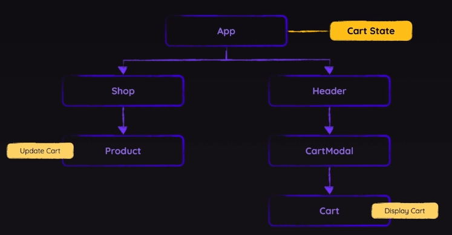
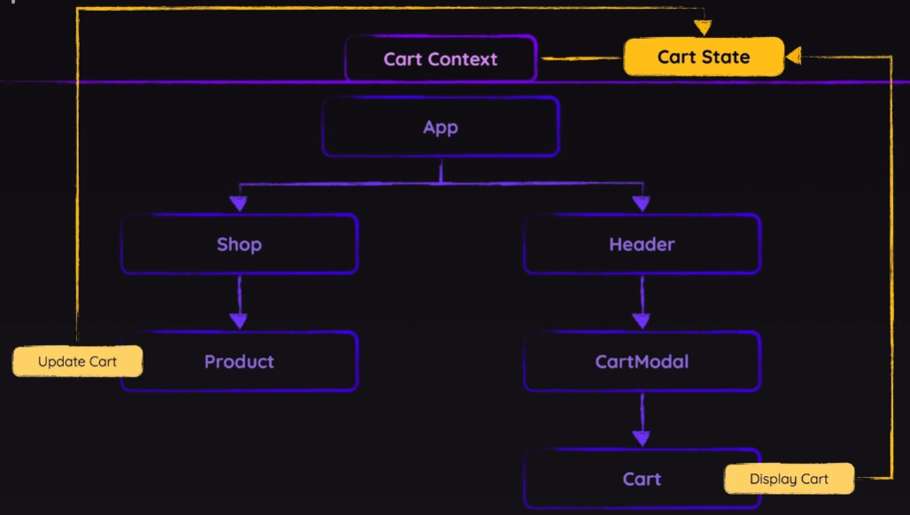

# Section10

## Prop Drilling



**Prop Drilling**

다수의 컴포넌트를 거쳐 속성을 전달
이럴 경우 컴포넌트 재사용에 어려움이 생긴다.

컴포넌트 합성을 통해서 해결하는 방안도 있겠으나 컴포넌트 차원에서 이상해진다.

## React's Context API



> Context API 사용 이유에 대해서는 이해했으나 사용법에 대해서는 아직 이해가 잘 되지 않음.

**Consumer**

```jsx
// Cart.jsx
import { CartContext } from "../store/shopping-cart";

export default function Cart() {
  return (
    <CartContext.Consumer>
      {(cartCtx) => {
        const totalPrice = cartCtx.items.reduce(
          (acc, item) => acc + item.price * item.quantity,
          0
        );
        const formattedTotalPrice = `$${totalPrice.toFixed(2)}`;

        return (
          <div id="cart">
            {cartCtx.items.length === 0 && <p>No items in cart!</p>}
            {cartCtx.items.length > 0 && (
              <ul id="cart-items">
                {cartCtx.items.map((item) => {
                  const formattedPrice = `$${item.price.toFixed(2)}`;

                  return (
                    <li key={item.id}>
                      <div>
                        <span>{item.name}</span>
                        <span> ({formattedPrice})</span>
                      </div>
                      <div className="cart-item-actions">
                        <button
                          onClick={() =>
                            cartCtx.updateCartItemQuantity(item.id, -1)
                          }
                        >
                          -
                        </button>
                        <span>{item.quantity}</span>
                        <button
                          onClick={() =>
                            cartCtx.updateCartItemQuantity(item.id, 1)
                          }
                        >
                          +
                        </button>
                      </div>
                    </li>
                  );
                })}
              </ul>
            )}
            <p id="cart-total-price">
              Cart Total: <strong>{formattedTotalPrice}</strong>
            </p>
          </div>
        );
      }}
    </CartContext.Consumer>
  );
}
```

이러한 방식으로도 사용할 수 있으나 다소 복잡한 부분이 있으므로 useContext훅으로 진행

```jsx
import { useContext } from "react";
import { CartContext } from "../store/shopping-cart";

export default function Cart() {
  const { items, updateCartItemQuantity } = useContext(CartContext);

  const totalPrice = items.reduce(
    (acc, item) => acc + item.price * item.quantity,
    0
  );
  const formattedTotalPrice = `$${totalPrice.toFixed(2)}`;

  return (
    <div id="cart">
      {items.length === 0 && <p>No items in cart!</p>}
      {items.length > 0 && (
        <ul id="cart-items">
          {items.map((item) => {
            const formattedPrice = `$${item.price.toFixed(2)}`;

            return (
              <li key={item.id}>
                <div>
                  <span>{item.name}</span>
                  <span> ({formattedPrice})</span>
                </div>
                <div className="cart-item-actions">
                  <button onClick={() => updateCartItemQuantity(item.id, -1)}>
                    -
                  </button>
                  <span>{item.quantity}</span>
                  <button onClick={() => updateCartItemQuantity(item.id, 1)}>
                    +
                  </button>
                </div>
              </li>
            );
          })}
        </ul>
      )}
      <p id="cart-total-price">
        Cart Total: <strong>{formattedTotalPrice}</strong>
      </p>
    </div>
  );
}
```

해당 방안이 코드도 적게 써도 되고 가독성도 좋음

## useReducer

`reducer` -> 하나 또는 그 이상의 복잡한 값을 더 단순한 형태로 만드는 함수
example) [5, 10, 100] -(reducer function)-> 115

상태 관리의 목적을 가지고 하나 또는 그 이상의 값을 보다 단순하게 하나의 값으로 줄이는 것

```jsx
const [상태값, reducer함수 연결 함수] = useReducer(reducer함수, 초기값)
```

👊🏻TODO: 해당 세션 강의 내용 없이 혼자 진행해볼 것
