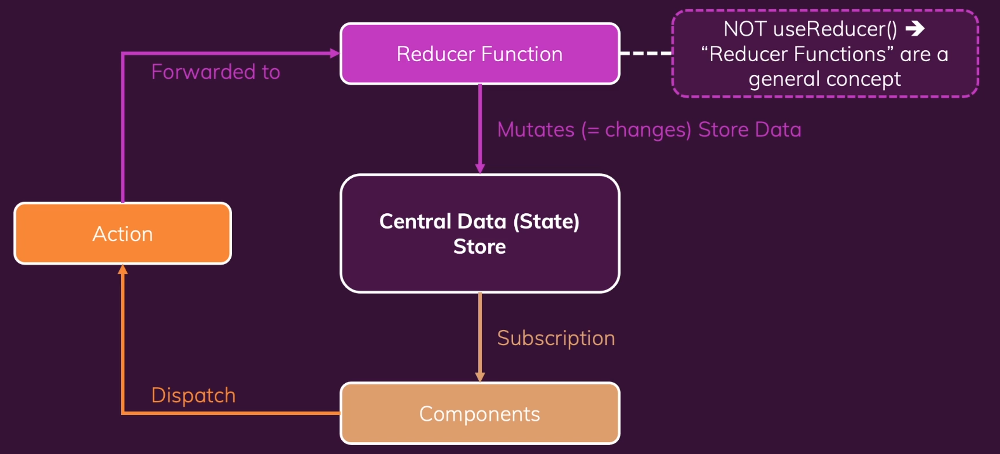

# Redux

리덕스는 크로스 컴포넌트 또는 앱 와이드 상태를 위한 상태 관리 시스템이다.

- Local State
- Cross-Component State: 다수의 컴포넌트에 영향을 주는 상태. ex) Modal
- App-Wide State: 대다수/모든 컴포넌트에 영향을 주는 상태.

> **Local State**
>
> : State that belongs to a single component.
>
> E.g. listening to user input in a input field; toggling a "show more" details field
>
> Should be managed component-internal with useState()/useReducer()
>
> **Cross-Component State**
>
> : State that affects multiple components.
>
> E.g. open/closed state of a modal overlay
>
> Requires "prop chains"/"prop drilling" or React Context / Redux
>
> **App-Wide State**
>
> : State that affects the entire app (most/all components)
>
> E.g. user authentication status
>
> Requires "prop chains"/"prop drilling" or React Context / Redux

## 리덕스 대 리액트 컨텍스트

React Context가 있는데 Redux는 왜 필요한가?
React Context는 잠재적인 단점이 존재한다. 이 단점이 발현되지 않을 곳에서는 Context를 사용해도 된다.
단점은 설정이 아주 복잡해질 수 있고 컨스트를 이용한 상태 관리가 상당히 복잡해질 수 있다는 점이다.
엔터프라이즈 형태의 대형 애플리케이션 구축시에는 복잡한 형태가 나오게 된다.

```jsx
// 예시
return (
  <AuthContextProvider>
    <ThemeContextProvider>
      <UIInteractionContextProvider>
        <MultiStepFromContextProvider>
          <UserRegistration />
        </MultiStepFromContextProvider>
      </UIInteractionContextProvider>
    </ThemeContextProvider>
  </AuthContextProvider>
);
```

잠재적인 단점은 성능이다.
고빈도 상태 변경에는 리액트 컨텍스트를 사용하지 말아야 한다.

## 리덕스 createStore()는 사용(불)가능합니다.

IDE에서 사용중단 경고가 나올 수 있으나 해당 경고는 무시해야 한다.
문제없이 사용가능하다.
리덕스 팀은 리덕스 툴킷이라는 추가 패키지와 리덕스 스토어를 생성하는 다른 방법 사용을 권장한다.
추후 다룰 것이기에 이전 사용법(createStore)에 대해서 먼저 익혀보자.



```bash
npm install redux react-redux
```

**Reducer Function**

순수 함수여야 한다.

- inputs: Old State + Dispatched Action
- output: New State Object

## 리액트 컴포넌트에서 리덕스 데이터 사용하기

useStore을 사용해도 되지만 선택해서 사용하기 위해 useSelector 이용

```js
import { useSelector, useDispatch, connect } from "react-redux";
```

connect 함수는 클래스 컴포넌트를 감싸는 래퍼로 사용해서 해당 클래스 컴포넌트를 저장소에 연결할 수 있다.
함수 컴포넌트에서는 useSelector와 useDispatch를 이용하는 것이 더 편리하다.

먼저, redux store 생성

```js
// store/index.js
import { createStore } from "redux";

const counterReducer = (state = { counter: 0 }, action) => {
  switch (action.type) {
    case "increment": {
      return {
        counter: state.counter + 1,
      };
    }
    case "decrement": {
      return {
        counter: state.counter - 1,
      };
    }
    default: {
      return state;
    }
  }
};

const store = createStore(counterReducer);

export default store;
```

그 후에 index.js에서 최상위단에 Provider를 추가해줬다.

```js
// index.js(root)
import React from "react";
import ReactDOM from "react-dom/client";
import { Provider } from "react-redux";

import "./index.css";
import App from "./App";
import store from "./store/index";

const root = ReactDOM.createRoot(document.getElementById("root"));
root.render(
  <Provider store={store}>
    <App />
  </Provider>
);
```

**함수형 컴포넌트**

```jsx
import { useSelector, useDispatch } from "react-redux";

import classes from "./Counter.module.css";

const Counter = () => {
  const dispatch = useDispatch();
  const counter = useSelector((state) => state.counter);

  const incrementHandler = () => {
    dispatch({ type: "increment" });
  };

  const decrementHandler = () => {
    dispatch({ type: "decrement" });
  };

  const toggleCounterHandler = () => {};

  return (
    <main className={classes.counter}>
      <h1>Redux Counter</h1>
      <div className={classes.value}>{counter}</div>
      <div>
        <button onClick={decrementHandler}>Decrement</button>
        <button onClick={incrementHandler}>Increment</button>
      </div>
      <button onClick={toggleCounterHandler}>Toggle Counter</button>
    </main>
  );
};

export default Counter;
```

**클래스형 컴포넌트**

```jsx
import { Component } from "react";
import { connect } from "react-redux";

import classes from "./Counter.module.css";

class Counter extends Component {
  incrementHandler() {
    this.props.increment();
  }
  decrementHandler() {
    this.props.decrement();
  }
  toggleCounterHandler() {}

  render() {
    return (
      <main className={classes.counter}>
        <h1>Redux Counter</h1>
        <div className={classes.value}>{this.props.counter}</div>
        <div>
          <button onClick={this.decrementHandler.bind(this)}>Decrement</button>
          <button onClick={this.incrementHandler.bind(this)}>Increment</button>
        </div>
        <button onClick={this.toggleCounterHandler}>Toggle Counter</button>
      </main>
    );
  }
}

const mapStateToProps = (state) => {
  return {
    counter: state.counter,
  };
};

const mapDispatchToProps = (dispatch) => {
  return {
    increment: () => dispatch({ type: "increment" }),
    decrement: () => dispatch({ type: "decrement" }),
  };
};

export default connect(mapStateToProps, mapDispatchToProps)(Counter);
```

클래스 컴포넌트는 Hook을 사용할 수 없기에 다음과 같이 작성한다.

## 리덕스 State를 올바르게 사용하는 방법

```jsx
import { createStore } from "redux";

const initCounter = { counter: 0, showCounter: true };

const counterReducer = (state = initCounter, action) => {
  switch (action.type) {
    case "increment": {
      return {
        counter: state.counter + 1,
        showCounter: state.showCounter,
      };
    }
    case "increase": {
      return {
        counter: state.counter + action.amount,
        showCounter: state.showCounter,
      };
    }
    case "decrement": {
      return {
        counter: state.counter - 1,
        showCounter: state.showCounter,
      };
    }
    case "toggle": {
      return {
        counter: state.counter,
        showCounter: !state.showCounter,
      };
    }
    default: {
      return state;
    }
  }
};

const store = createStore(counterReducer);

export default store;
```

이렇게 작성되어 있는 것을 변경하여 다음과 같이 작성해도 되지 않나?

```jsx
case "increment": {
  state.counter++;

  return state;
}
```

Redux로 작업할 때 다음과 같이 하면 절대 안된다.
**절대 기존의 state를 변형/변경해서는 안된다.**
대신에, **새로운 state 객체를 반환하여 항상 재정의**한다.

참고 링크: https://academind.com/tutorials/reference-vs-primitive-values

지금까지 작성한 것처럼 Redux store를 관리하면 다음과 같은 문제들이 발생할 수 있다.

1. action type의 오타가 생기면 문제가 발생한다.
2. 구조가 커지면 커질수록 한 파일에 너무 방대해져 유지관리가 어려워진다.
3. state가 많아지고 복잡해지면 빼먹거나 해서 문제가 발생할 수 있다.

이러한 해결 방안으로 Redux Toolkit을 사용할 수 있다.

## Redux Toolkit

https://redux-toolkit.js.org/

```bash
npm install @reduxjs/toolkit
```

해당 패키지를 사용하려면 redux 라이브러리는 사용하지 말아야 한다.
Redux Toolkit에 포함되어 있기 때문이다.

createSlice가 createReducer보다 더 강력하다.
그리고 createSlice는 한 번에 몇 가지를 단순화한다.

Redux Toolkit과 createSlice의 경우에는 기존의 상태를 변경 시킬 수 없다.
Redux Toolkit은 내부적으로 `immer`라는 다른 패키지를 사용하는데 코드를 감지하고 자동으로 원래 있는 상태를 복제한다. 그리고 새로운 상태 객체를 생성하고 모든 상태를 변경할 수 없게 유지한다. 개발자가 변경한 상태는 변하지 않도록 오버라이드 한다. 그래서 불변성을 고려하지 않고 상태를 직접 변경할 수 있다.

```js
// store/index.js
import { createSlice, configureStore } from "@reduxjs/toolkit";

const initCounter = { counter: 0, showCounter: true };

const counterSlice = createSlice({
  name: "counter",
  initialState: initCounter,
  reducers: {
    increment(state) {
      state.counter++;
    },
    decrement(state) {
      state.counter--;
    },
    increse(state, action) {
      state.counter = state.counter + action.payload; // Redux Toolkit에서 action에는 payload 속성이다.
    },
    toggleCounter(state) {
      state.showCounter = !state.showCounter;
    },
  },
});

const store = configureStore({
  reducer: counterSlice.reducer,
});

export const counterActions = counterSlice.actions;
export default store;
```

```js
// Counter.js
import { useSelector, useDispatch } from "react-redux";

import { counterActions } from "../store";
import classes from "./Counter.module.css";

const Counter = () => {
  const dispatch = useDispatch();
  const counter = useSelector((state) => state.counter);
  const show = useSelector((state) => state.showCounter);

  const incrementHandler = () => {
    dispatch(counterActions.increment());
  };

  const increseHandler = () => {
    dispatch(counterActions.increse(5));
  };

  const decrementHandler = () => {
    dispatch(counterActions.decrement());
  };

  const toggleCounterHandler = () => {
    dispatch(counterActions.toggleCounter());
  };

  return (
    <main className={classes.counter}>
      <h1>Redux Counter</h1>
      {show && <div className={classes.value}>{counter}</div>}
      <div>
        <button onClick={decrementHandler}>Decrement</button>
        <button onClick={incrementHandler}>Increment</button>
        <button onClick={increseHandler}>Increment by 5</button>
      </div>
      <button onClick={toggleCounterHandler}>Toggle Counter</button>
    </main>
  );
};

export default Counter;
```

## 다중 슬라이스 작업하기

**⚠️ 진행 도중 내가 실수했던 것**

```js
import { useDispatch } from "react-redux";

import { authActions } from "../store/index";
import classes from "./Auth.module.css";

const Auth = () => {
  const dispatch = useDispatch();

  const loginHandler = () => {
    dispatch(authActions.login());
  };

  return (
    <main className={classes.auth}>
      <section>
        <form>
          <div className={classes.control}>
            <label htmlFor="email">Email</label>
            <input type="email" id="email" />
          </div>
          <div className={classes.control}>
            <label htmlFor="password">Password</label>
            <input type="password" id="password" />
          </div>
          <button onClick={loginHandler}>Login</button>
        </form>
      </section>
    </main>
  );
};

export default Auth;
```

이렇게 진행했었음.
form이기에 button default type은 `submit`으로 되어 있다. 그래서 click이벤트가 발생하면 redirect가 이루어져 새로고침이 된다. Header에 Logout으로 바뀌었다가 Login으로 바로 변경되는 이유가 이러한 이유에서 였다.

```js
import { useDispatch } from "react-redux";

import { authActions } from "../store/index";
import classes from "./Auth.module.css";

const Auth = () => {
  const dispatch = useDispatch();

  const loginHandler = (event) => {
    event.preventDefault();

    dispatch(authActions.login());
  };

  return (
    <main className={classes.auth}>
      <section>
        <form onSubmit={loginHandler}>
          <div className={classes.control}>
            <label htmlFor="email">Email</label>
            <input type="email" id="email" />
          </div>
          <div className={classes.control}>
            <label htmlFor="password">Password</label>
            <input type="password" id="password" />
          </div>
          <button>Login</button>
        </form>
      </section>
    </main>
  );
};

export default Auth;
```

위와 같이 변경하면 된다.

## 파일 분할

```js
// store/index.js
import { configureStore } from "@reduxjs/toolkit";

import counterReducer from "./counter";
import authReducer from "./auth";

const store = configureStore({
  reducer: {
    counter: counterReducer,
    auth: authReducer,
  },
});

export default store;
```

```js
// store/counter.js
import { createSlice } from "@reduxjs/toolkit";

const initCounterState = { counter: 0, showCounter: true };

const counterSlice = createSlice({
  name: "counter",
  initialState: initCounterState,
  reducers: {
    increment(state) {
      state.counter++;
    },
    decrement(state) {
      state.counter--;
    },
    increse(state, action) {
      state.counter = state.counter + action.payload;
    },
    toggleCounter(state) {
      state.showCounter = !state.showCounter;
    },
  },
});

export default counterSlice.reducer;
export const counterActions = counterSlice.actions;
```

```js
// store/auth.js
import { createSlice } from "@reduxjs/toolkit";

const initAuthState = {
  isAuthenticated: false,
};

const authSlice = createSlice({
  name: "authentication",
  initialState: initAuthState,
  reducers: {
    login(state) {
      state.isAuthenticated = true;
    },
    logout(state) {
      state.isAuthenticated = false;
    },
  },
});

export default authSlice.reducer;
export const authActions = authSlice.actions;
```

당연히 이에 맞게 연결된 컴포넌트들도 수정은 해줘야 한다.
