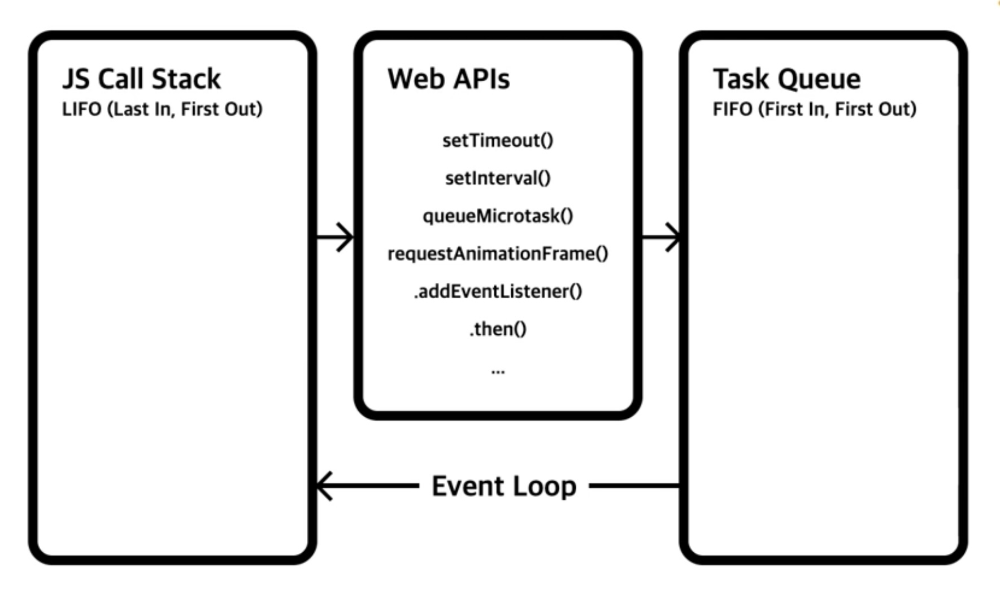

# JS

## EMCA스크립트

### 템플릿 리터럴

`(백틱)을 써서 변수를 사용하는 방식

#### 부동 소수점 오류

0.1 + 0.2 = 0.3000000000004 이런식으로 나오게 되는데 이 부분을 처리하기 위해서 `.toFixed(1)`을 사용하면 된다.

주의할 점은 반환되는 데이터 타입이 문자타입이라는 것이다.

`Number((0.1 + 0.2).toFixed(1))`

### 참조형 Object

```js
// 생성자 함수를 통한 객체 데이터 생성
const user = new Object();
user.name = "June";
user.age = 33;

console.log(user);

// 함수를 통한 객체 데이터 생성
function User() {
  this.name = "June";
  this.age = 33;
}
const user = new User();

console.log(user);

// 중괄호 기호를 통한 객체 데이터 생성
const user = {
  name: "June",
  age: 33,
};

console.log(user.name); // 점 표기법
console.log(user["name"]); // 대괄호 표기법
```

객체데이터에서 속성의 이름(키)는 고유하다. 각각의 키는 순서가 따로 존재하지 않는다.

```js
const userA = {
  name: "june",
  age: 33,
};

const userB = {
  name: "B",
  age: 1,
  parent: userA,
};

userB.parent.age = 36;

console.log(userA.age); // 36
```

### 데이터 타입 확인

```js
typeof null // object
typeof []   // object
typeof {}   // object

// null과 배열, 객체를 어떻게 구별할 것인가?

[].constructor === Array
{}.constructor === Object
// null은 constructor가 없음

Object.prototype.toString.call(null).slice(8, -1) === 'Null'

// Object.prototype을 이용한 타입 체크 함수 만들기
function typeCheck(data) {
  return Object.prototype.toString.call(data).slice(8, -1);
}

typeCheck(null) // Null
typeCheck([]) // Array
typeCheck({}) // Object
typeCheck('Hello') // String
```

파이썬과 다르게 비어있는 배열과 객체에 대해서 참/거짓 값이 참이 나옴.

```js
!![]; // true
!!{}; // true
```

### 논리 연산자

AND 연산자

```js
console.log(0 && 1 && 2); // 0
console.log("A" && "B" && "C"); // 'C'
console.log("A" && "B" && ""); //
```

### Nullish 병합, 삼항 연산자

```js
const n = 0;

const num1 = n || 3; // 3

// 원하는 것은 null의 값이면 3을 넣고 싶은 것이고 0일 때는 0이 들어가게 하고 싶다.
/* Nullish 병합 연산자 사용 */
const num = n ?? 3; // 0  -> null과 undefined만 걸러짐
```

### 전개 연산자(Spread Operator)

```js
// 배열 전개 연산
const a = [1, 2, 3];
const b = [4, 5, 6];

const c = a.concat(b);
const d = [...a, ...b];

// 객체 전개 연산
const a = { x: 1, y: 2 };
const b = { y: 3, z: 4 };

const c = Object.assign({}, a, b);
const d = { ...a, ...b };

function fn(x, y, z) {
  console.log(x, y, z);
}

const a = [1, 2, 3];
fn(...a);
```

### 구조 분해 할당(Destructuring assignment)

```js
/* 배열의 구조 분해 할당 */
const arr = [1, 2, 3];
const [a, b, c] = arr;

// 만약 2와 3의 값만 받기 원한다면
const [, b, c] = arr;

// 나머지 값을 뒤에 값이 다 받기 위해서는?
const [a, ...rest] = arr;

/* 객체의 구조 분해 할당 */
const obj = {
  a: 1,
  b: 2,
  c: 3,
};

// 사용하고자 하는 키 값만 받아서 사용
const { a, b: x = 5 } = obj; // b의 값이 없으면 초기값 5, 있으면 있는 값으로 -> b: x를 이용하여 변수 이름을 x로 변경

// 전개 연산자를 이용해 나머지 받기
const obj2 = {
  a: 1,
  b: 2,
  c: 3,
  x: 7,
  y: 100,
};

const { x, ...rest } = obj2;
```

### 선택적 체이닝

```js
const user = null;

console.log(user?.name);
```

`user.name`이었다면 SyntaxError가 발생하는데 프로그램에서 이렇게 문제가 발생하면 강제 종료되거나 문제가 생기니 문법적으로 `?.` 선택적 체이닝을 통해 접근이 안되면 undefined가 나와 종료 없이 가정문 방식으로 처리할 수 있다.

### for 반복문

#### for of 반복문

```js
const fruits = ["Apple", "Banana", "Cherry"];

for (const fruit of fruits) {
  console.log(fruit);
}

const users = [
  {
    name: "A",
    age: 11,
  },
  {
    name: "B",
    age: 22,
  },
  {
    name: "C",
    age: 33,
  },
];

for (const user of users) {
  console.log(user);
}
```

#### for in 반복문

```js
const user = {
  name: 'A',
  age: 11,
  isValid: true,
  email: A@B.C
}

for (const key in user) {
  console.log(key, user[key])
}
```

## 함수

### 함수 선언과 표현 그리고 호이스팅

```js
// 호이스팅
hello1(); // 호이스팅 이뤄짐
hello2(); // 정의하라고 에러발생됨 (함수 표현식은 호이스팅 안됨)

// 함수 선언
function hello1() {
  console.log("Hello");
}

// 함수 표현식
const hello2 = function () {
  console.log("Hello");
};
```

### 나머지 매개변수

```js
function sum(...rest) {
  console.log(arguments); // 유사 배열
  return rest.reduce((acc, cur) => {
    return acc + cur;
  }, 0);
}

console.log(sum(1, 2, 3, 4, 5, 6, 7, 8, 9, 10));
```

`arguments`를 이용하면 유사 배열 형태로 값들을 받아올 수는 있으나, `reduce`와 같은 함수들을 사용할 수 없다.

직관적이지도 않은 점도 한몫 한다.

### 화살표 함수

```js
const arr1 = (a, b) => {
  return a + b;
};

// 중괄호와 return 키워드를 생략하고 작성 가능(단, 중간 다른 로직 있으면 안됨)
const arr2 = (a, b) => a + b;

const a = () => {
  return { a: 1 };
};
// 이와 같은 경우는 안됨. 중괄호 기호가 함수의 영역 중괄호인지 객체의 중괄호인지 모호하기에 문제가 생김
const b = () => {
  a: 1;
};

// 이런 경우 () 소괄호를 묶어줌으로서 처리해야함
const c = () => ({ a: 1 });
```

### 즉시 실행 함수(IIFE, Immediately-Invoked Function Expression)

```js
((a, b) => {
  console.log("Hello");
  console.log(a, b);
})(3, 5);

// 1. (F)()
// 2. (F())
// 3. !F()
// 4. +F()
// 5. ()()

// 코드 난독화. 인자와 매개변수를 다르게 해서 즉시 실행
((a, b) => {
  console.log(a.innerWidth);
  console.log(b.body);
})(window, document);
```

### 콜백(Callback)

```js
const sum = (a, b, callback) = {
  setTimeout(() => {
    // return a + b; // 해당 값을 어떻게 받을 것인가?
    callback(a + b)
  }, 1000)
}

sum(1, 2, value => {
  console.log(value)
})
```

위와 같은 방도를 이용한 loading 메세지 1초 보여주고 이미지 보여주는 로직

```html
<!DOCTYPE html>
<html lang="ko">
  <head>
    <meta charset="UTF-8" />
    <meta name="viewport" content="width=device-width, initial-scale=1.0" />
    <title>Document</title>
    <script type="module" defer src="./main.js"></script>
  </head>
  <body>
    <div class="container">
      <h1>Loading...</h1>
    </div>
  </body>
</html>
```

```js
const loadImg = (url, callback) => {
  const imgEl = document.createElement("img");
  imgEl.src = url;
  imgEl.addEventListener("load", () => {
    setTimeout(() => {
      callback(imgEl);
    }, 1000);
  });
};

const $containerEl = document.querySelector(".container");
const url = "https://www.gstatic.com/webp/gallery/4.jpg";
loadImg(url, (imgEl) => {
  $containerEl.innerHTML = "";
  $containerEl.append(imgEl);
});
```

### 호출 스케줄링(Scheduling a function call)

```js
const timeout = setTimeout(() => {
  console.log("Hello");
}, 1000);

clearTimeout(timeout); // setTimeout clear시킴 -> 1초뒤 콘솔에 안나옴. 이벤트에 적용하면 이벤트 적용 될 때 안되게 처리할 수 있음

// setInterval도 동일함. clearInterval
```

### this

- 일반 함수의 this는 호출 위치에서 정의
- 화살표 함수의 this는 자신이 선언된 함수(렉시컬) 범위에서 정의

> **렉시컬(Lexical)**
>
> : 함수가 동작할 수 있는 유효한 범위

```js
function user() {
  this.firstName = "Neo";
  this.lastName = "Anderson";

  return {
    firstName: "Heropy",
    lastName: "Park",
    age: 85,
    getFullName() {
      return `${this.firstName} ${this.lastName}`;
    },
  };
}

const u = user();
console.log(u.getFullName());

const lewis = {
  firstName: "Lewis",
  lastName: "Yang",
};

// lewis에 없는 getFullName 사용하는 방안
console.log(u.getFullName.call(lewis));
```

함수 생성자 안에 쓰이는 함수는 메서드로서 `: function`을 생략하고도 사용할 수 있다.

```js
// 1. 일반적 방식
getFullName: function() {};
// 2. 메서드 문법으로 생략
getFullName() {};
// 3. 화살표 함수 방식
getFullName: () => {};
```

단, 일반 함수와 화살표 함수의 `this`인식 차이로 인하여 값이 달라질 수 있다는 점 염두해야한다.

```js
const timer = {
  title: "TIMER!",
  timeout() {
    console.log(this.title);
    setTimeout(function () {
      console.log(this.title);
    }, 1000);
  },
};

timer.timeout();

// setTimeout callback함수로 정의된 부분에서 일반함수의 this는 호출 위치에서 정의되기에 undefined가 나오게 된다.

만약 함수 내부에 또 다른 함수가 들어있는 구조라면 일반 함수보다는 화살표 함수를 쓰는 것이 훨씬 더 적합하다.

setTimeout함수의 첫 번째 인수로 사용되는 callback화살표 함수는 그 내부에서 사용하는 this키워드가 선언된 함수 범위에서 정의가 된다. this키워드를 사용하는 이 부분에 callback함수를 감싸고 있는 또 다른 함수는 timeout이라는 함수가 감싸고 있다. 그래서 timeout 함수가 가지고 있는 this키워드는 결과적으로 timer라는 객체 데이터이고 거기에서의 this와 callback에서의 this는 사실상 같은 것이 된다.
```

## 클래스

JS는 Prototype언어

```js
// 선언하지 않은 함수 사용하는 법1
const heropy = {
  firstName: "heropy",
  lastName: "Park",
  getFullName() {
    return `${this.firstName} ${this.lastName}`;
  },
};

const neo = {
  firstName: "Neo",
  lastName: "Anderson",
};

console.log(heropy.getFullName());
console.log(heropy.getFullName.call(neo));

// 선언하지 않은 함수 사용하는 법2
function User(first, last) {
  this.firstName = first;
  this.lastName = last;
}
User.prototype.getFullName = function () {
  // 일반함수 사용해야함. 화살표 함수 사용하면X
  return `${this.firstName} ${this.lastName}`;
};

// 3. 클래스 문법
class User {
  constructor(first, last) {
    this.firstName = first;
    this.lastName = last;
  }

  getFullName() {
    return `${this.firstName} ${this.lastName}`;
  }
}

const heropy = new User("Heropy", "Park");
const neo = new User("Neo", "Anderson");
```

### Getter, Setter

```js
class User {
  constructor(first, last) {
    this.firstName = first;
    this.lastName = last;
  }

  get fullName() {
    return `${this.firstName} ${this.lastName}`;
  }

  set fullName(value) {
    [this.firstName, this.lastName] = value.split(" ");
  }
}

const heropy = new User("Heropy", "Park");
console.log(heropy.fullName);

heropy.fullName = "Neo Anderson";
console.log(heropy);
```

### 정적 메서드

`Array.prototype.includes()`와 `Array.isArray()`를 보면 앞에는 prototype이 있고 isArray는 prototpye없이 쓰이는데 어떠한 차이가 있는가?

prototype없이 쓰이면 정적 메서드.

```js
class User {
  constructor(first, last) {
    this.firstName = first;
    this.lastName = last;
  }

  getFullName() {
    return `${this.firstName} ${this.lastName}`;
  }

  static isUser(user) {
    return user.firstName && user.lastName ? true : false;
  }
}

const heropy = new User("Helropy", "Park");

console.log(User.isUser(heropy));
```

정적 메서드는 클래스로 바로 접근은 가능하나 인스턴스 객체에서는 접근할 수 없다.

### 상속과 instanceof

```js
class Vehicle {
  constructor(acceleration = 1) {
    this.speed = 0;
    this.aceeleration = acceleration;
  }

  accelerate() {
    this.speed += this.acceleration;
  }
  decelerate() {
    if (this.speed <= 0) {
      console.log("STOP");
      return;
    }
    this.speed -= this.acceleration;
  }
}

class Bicycle extends Vehicle {
  constructor(price = 100, acceleration) {
    super(acceleration);
    this.price = price;
    this.wheel = 2;
  }
}

const bicycle = new Bicycle(300);
bicycle.accelerate();
bicycle.accelerate();
console.log(bicycle);
console.log(bicycle instanceof Bicycle);
console.log(bicycle instanceof Vehicle);

class Car extends Bicycle {
  constructor(license, price, acceleration) {
    super(price, acceleration);
    this.license = license;
    this.wheel = 4;
  }

  // Overriding
  accelerate() {
    if (!this.license) {
      console.error("무면허!");
      return;
    }
    this.speed += this.acceleration;
    console.log("가속:", this.speed);
  }
}

const car = new Car();

class Boat extends Vehicle {
  constructor(price, acceleration) {
    super(acceleration);
    this.price = price;
    this.motor = 1;
  }
}
```

## 표준 내장 객체

### 문자(String)

- length
- includes()
  `includes(문자, 시작 인덱스)`로 반환값은 boolean

- indexOf()
  `indexOf(문자)` 반환값은 인덱스 (없다면 -1)

- padEnd()
  : 대상 문자의 길이가 지정된 길이보다 작으면, 주어진 문자를 지정된 길이까지 끝에 붙여 새로운 문자를 반환

```js
const str = "1234567";

console.log(str.padEnd(10, "0")); // 1234567000
```

padStart()함수는 앞에 붙여지는 방식

- replace()

: 대상 문자에서 패턴(문자, 정규식)과 일치하는 부분을 교체한 새로운 문자를 반환합니다.

```js
const str = "Hello, Hello?!";

console.log(str.replace("Hello", "Hi")); // Hi, Hello?!
console.log(str.replace(/Hello/g, "Hi")); // Hi, Hi?!
```

- slice()
  : 대상 문자의 일부를 추출해 새로운 문자를 반환
  두번째 인수 직전까지 추출하고, 두 번째 인수를 생략하면 대상 문자의 끝까지 추출

```js
const str = "Hello world!";

console.log(str.slice(0, 5)); // Hello
console.log(str.slice(6, -1)); // world
console.log(str.slice(6)); // world!
```

- split()
  : 대상 문자를 주어진 구분자로 나눠 배열로 반환

```js
const str = "Apple, Banana, Cherry";

console.log(str.split(", ")); // [Apple, Banana, Cherry]

// 문자열을 거꾸로 출력하는 방법
console.log(str.split("").reverse().join(""));
```

- toLowerCase()
  : 대상 문자를 영어 소문자로 변환해 새로운 문자로 반환

toUpperCase()는 이의 반대로 대문자로 반환

- trim()
  : 대상 문자의 앞뒤 공백 문자(space, tab 등)를 제거한 새로운 문자 반환

### 숫자(Number)

- toFixed()
  : 숫자를 지정된 고정 소수점 표기(자릿수)까지 표현하는 문자로 반환

```js
const num = 3.141592;

console.log(num.toFixed(2)); // 3.14 (문자 타입)
console.log(parseFloat(num.toFixed(2))); // 3.14 (숫자 타입)
```

- toLocaleString()
  : 숫자를 현지 언어 형식의 문자로 반환

```js
const num = 1000000;

console.log(num.toLocaleString()); // 1,000,000
```

- Number.isInteger()
  : 숫자가 정수(Integer)인지 확인

- Number.isNaN()
  : 주어진 값이 NaN인지 확인

- Number.parseInt() 또는 parseInt()
  :`Number.parseInt(숫자/문자, radix)`주어진 값(숫자/문자)를 파싱해 특정 진수(radix)의 정수로 반환

parseFloat()는 부동소수점 실수로 반환

### 수학(Math)

- Math.abs()
  : 주어진 숫자의 절대값 반환

- Math.ceil()
  : 주어진 숫자 올림해 정수 반환

Math.floor()는 내림해 정수 반환

Math.round()는 반올림 정수 반환

- Math.max()
  : 주어진 숫자 중 가장 큰 숫자 반환

Math.min()은 가장 낮은 숫자 반환

- Math.pow()
  : `Math.pow(밑, 지수)` 주어진 숫자의 거듭제곱한 값을 반환

- Math.random()
  : 숫자 0 이상 1 미만의 난수 반환

### 날짜(Date)

```js
const d1 = new Date(2022, 11, 16, 12, 57, 30);
console.log(d1); // Fri Dec 16 2022 12:57:30 GMT+0900 (한국 표준시)

const d2 = new Date("Fri Dec 16 2022 12:57:30 GMT+0900 (한국 표준시)");
console.log(d2); // Fri Dec 16 2022 12:57:30 GMT+0900 (한국 표준시)
console.log(d2.getFullYear()); // 2022

d2.setFullYear(2024);
console.log(d2); // Fri Dec 16 2024 12:57:30 GMT+0900 (한국 표준시)

// JS에서는 월에 대해서 zero-base numbering을 사용하여 0이면 1월, 1이면 2월...
d2.setMonth(0);
console.log(d2.getMonth()); // 0

d2.setDate(26);
console.log(d2.getDate()); // 26

d2.setHours(16);
console.log(d2.getHours()); // 16

d2.setMinutes(7);
console.log(d2.getMinutes()); // 7

d2.setSeconds(57);
console.log(d2.getSeconds()); // 57

// getDay() : 날짜 인스턴스의 '요일'을 반환
const day = d2.getDay();
// 0: 일요일, 1: 월요일, ... 6: 토요일

// getTime() / setTime()
// : 1970-01-01 00:00:00 (유닉스 타임)부터 경과한 날짜 인스턴스의 밀리초(ms)로 변환하거나 지정
const date = new Date();
console.log(date.getTime()); // 1721977979960
console.log(date); // Fri Jul 26 2024 16:12:59 GMT+0900 (한국 표준시)

Date.prototype.isAfter = function (date) {
  const a = this.getTime();
  const b = date.getTime();

  return a > b;
};

const d1 = new Date(1700000000000);
const d2 = new Date(1800000000000);

console.log(d1.isAfter(d2)); // false
console.log(d2.isAfter(d1)); // true

// Date.now() : 현재 날짜시간을 ms로 반환
```

### 배열

- length
- at() : 다음 배열을 인덱싱. 음수 값을 쓰면 뒤에서부터 인덱싱. cf) 일반적 인덱싱에서는 마이너스 인덱싱 안됨.
- concat() : 대상 배열과 주어진 배열을 병합해 새로운 배열을 반환

```js
const arr1 = [1, 2, 3];
const arr2 = [4, 5, 6];
const arr3 = arr1.concat(arr2);
const arr4 = [...arr1, ...arr2];
```

- every() : 대상 배열의 모든 요소가 콜백 테스트에서 참(Truthy)을 반환하는지 확인

```js
const arr = [1, 2, 3, 4];
const isValid1 = arr.every((item) => item < 5); // true
const isValid2 = arr.every((item) => item < 3); // false
```

- filter() : 주어진 콜백 테스트를 통과하는 모든 요소를 새로운 배열로 반환. 모두 통과 못할 시 빈 배열 반환

```js
const numbers = [1, 20, 7, 104, 0, 58];
const filteredNumbers = numbers.filter((number) => number > 30);

console.log(filteredNumbers); // [104, 58]

const users = [
  { name: "A", age: 33 },
  { name: "B", age: 22 },
  { name: "C", age: 11 },
];
const adults = users.filter((user) => user.age >= 19);
console.log(adults); // [{name: 'A', age: 33}, {name: 'B', age: 22}]
```

- find() : 대상 배열에서 콜백 테스트를 통과하는 첫 번째 요소를 반환. 없으면 `undefined`

```js
const arr = [5, 8, 130, 12, 44];
const foundItem = arr.find((item) => item > 10);

console.log(foundItem); // 130
```

- findIndex() : 대상 배열에서 콜백 테스트를 통과하는 첫 번째 요소의 인덱스 반환. 없으면 -1

- flat() : 대상 배열의 모든 하위 배열을 지정한 깊이(Depth)까지 이어붙인 새로운 배열을 생성 (default: 1)

```js
const arr = [
  1,
  2,
  [3, 4],
  [
    [5, 6],
    [7, 8],
  ],
];

console.log(arr.flat()); // [1, 2, 3, 4, Array(2), Array(2)] -> 복잡한 구조의 배열에서는 flat을 다 하진 못함.
// 이렇게 복잡한 것들을 해결하기 위해 loadsh flatten함수를 사용하는 것으로 보임.

console.log(arr.flat(2)); // 이렇게 쓰면 해결됨.

// [1,2,[3,4], [[5,6], [7,8], [[1,2], [[3,4]]]]] 이렇게 더 복잡한 것도 depth를 크게 주니 해결됨.
// TODO: depth 값을 크게 주면 그냥 다 되는거 아닌가? 성능 저하나 다른 문제가 있나?
```

얼마나 깊이가 깊은지는 모르나 다 flat하게 1차원 배열로 나타내고 싶다면 `.flat(Infinity)`를 이용하면 됨.

- forEach() : 대상 배열의 길이만큼 주어진 콜백을 실행

```js
const arr = [11, 22, 33];
arr.forEach((item) => console.log(item * item));
```

- includes() : 대상 배열의 특정 요소를 포함하고 있는지 확인

```js
const arr = [1, 2, 3];
console.log(arr.includes(7)); // false

const users = [
  { name: "A", age: 33 },
  { name: "B", age: 22 },
  { name: "C", age: 11 },
];

console.log(users.includes({ name: "A", age: 33 })); // false

const userA = users[0];
console.log(users.includes(userA)); // true
```

JS는 데이터타입이 크게 원시형과 참조형으로 나뉘어져 있다.

참조형에는 객체, 배열, 함수가 있다.

참조형은 데이터의 생김새가 같아도 메모리 주소값이 달라 다른 데이터일 수 있다.

- join() : 대상 배열의 모든 요소를 구분자로 연결한 문자를 반환

- map() : 대상 배열의 길이만큼 주어진 콜백을 실행하고, 콜백의 반환 값을 모아 새로운 배열을 반환

```js
const numbers = [1, 2, 3, 4, 5];
const newNumbers = numbers.map((item) => item * 2);

console.log(newNumbers); // [2, 4, 6, 8, 10]

const users = [
  { name: "A", age: 33 },
  { name: "B", age: 22 },
  { name: "C", age: 11 },
];

const newUsers = users.map((user) => {
  return {
    ...user,
    isValid: true,
    email: null,
  };
});

/* 다음과 같이 작성할 수도 있음 */
const newUsers = users.map((user) => ({
  ...user,
  isValid: true,
  email: null,
}));

console.log(newUsers);
```

- pop() : 대상 배열에서 마지막 요소를 제거하고 그 요소를 반환. ⚠️대상 배열 원본이 변경된다.
- push() : 대상 배열의 마지막에 하나 이상의 요소를 추가하고, 배열의 새로운 길이를 반환. ⚠️대상 배열 원본이 변경된다.

```js
const arr = [1, 2, 3];
const plusArr = [5, 6, 7];

const newLength = arr.push(4);
console.log(newLength); // 4
console.log(arr); // [1,2,3,4]

arr.push(...plusArr);
console.log(arr); // [1,2,3,4,5,6,7]
```

- reduce() : 대상 배열의 길이만큼 주어진 콜백을 실행하고, 마지막에 호출되는 콜백의 반환 값을 반환. 각 콜백의 반환 값은 다음 콜백으로 전달됨.

```js
const numbers = [1, 2, 3, 4, 5];
const sum = numbers.reduce((acc, cur) => {
  return acc + cur;
}, 0);

console.log(sum);

const users = [
  { name: "A", age: 33 },
  { name: "B", age: 22 },
  { name: "C", age: 11 },
];

// 총 나이 계산
const totalAge = users.reduce((acc, cur) => acc + cur.age, 0);
console.log(totalAge);

const names = users
  .reduce((acc, cur) => {
    acc.push(cur.name);
    return acc;
  }, [])
  .join(", ");
console.log(names);
```

- reverse() : 대상 배열의 순서를 반전된 배열 반환. ⚠️대상 배열 원본이 변경된다.

```js
const arr = ["A", "B", "C"];
const reversed = arr.reverse();

console.log(reversed); // ['C', 'B', 'A']
console.log(arr); // ['C', 'B', 'A']
```

- shift() : 대상 배열에서 첫 번째 요소를 제거하고, 제거된 요소를 반환. ⚠️대상 원본이 변경된다.

pop은 마지막 요소를 반환하면서 제거했다면 shift는 첫 번째 요소를 반환하면서 제거.

```js
const arr = ["A", "B", "C"];

console.log(arr.shift()); // A
console.log(arr); // ['B', 'C']
```

- slice() : 대상 배열의 일부를 추출해 새로운 배열을 반환. 두번쨰 인수 직전까지 추출하고, 두번째 인수를 생략하면 대상 배열의 끝까지 추출.

```js
const arr = ["A", "B", "C", "D", "E", "F", "G"];

console.log(arr.slice(4, -1)); // ['E', 'F']
console.log(arr.slice(4)); // ['E', 'F', 'G']
```

- some() : 대상 배열의 어떤 요소라도 콜백 테스르를 통과하는지 확인. 하나도 조건에 참이 아니여야 false값 반환.

```js
const arr = [1, 2, 3, 4, 5];
const isValid = arr.some((item) => item > 3);

console.log(isValid); // true
```

- sort() : 대상 배열을 콜백의 반환 값(음수, 양수, 0)에 따라 정렬. 콜백을 제공하지 않으면, 요소를 문자열로 반환하고 유니코드 코드 포인트 순서로 정렬. ⚠️대상 배열 원본이 변경된다.

```js
const numbers = [4, 17, 2, 103, 3, 1, 0];

numbers.sort();
console.log(numbers); // [0, 1, 103, 17, 2, 3, 4]

numbers.sort((a, b) => a - b);
console.log(numbers); // [0, 1, 2, 3, 4, 17, 103]

numbers.sort((a, b) => b - a);
console.log(numbers); // [103, 17, 4, 3, 2, 1, 0]
```

- splice() : 대상 배열에 요소를 추가하거나 삭제하거나 교체. ⚠️대상 배열 원본이 변경된다.

`splice(인덱스, 삭제갯수, 요소)`

```js
const arr = ["A", "B", "C"];
arr.splice(2, 0, "X");

console.log(arr); // ['A', 'B', 'X', 'C']

arr.splice(1, 1); // B 제거 deleteCount를 1이 아닌 2 작성시에 B뒤에 X까지 삭제됨.

console.log(arr); // ['A', 'X', 'C']

arr.splice(1, 2, "x", "y"); // 'X'와 'C' 제거 후에 x, y 추가

console.log(arr); // ['A', 'x', 'y']

arr.splice(0, 1, "a"); // 'A'를 'a'로 교체

console.log(arr); // ['a', 'x', 'y']
```

- unshift() : 새로운 요소를 대상 배열의 맨 앞에 추가하고 새로운 배열의 길이 반환. ⚠️대상 배열 원본이 변경된다.

```js
const arr = ["A", "B", "C"];

console.log(arr.unshift("X")); // 4
console.log(arr); // ['X', 'A', 'B', 'C']
```

- Array.from() : 유사 배열(Array-like)을 실제 배열로 반환

```js
const arrayLike = {
  0: "A",
  1: "B",
  2: "C",
  length: 3,
};

console.log(arrayLike.constructor === Array); // false
console.log(arrayLike.constructor === Object); // true

Array.from(arrayLike).forEach((item) => console.log(item)); // 객체 타입인데 배열 forEach를 사용하고 있음.
```

- Array.isArray() : 배열 데이터인지 확인

```js
const array = ["A", "B", "C"];
const arrayLike = {
  0: "A",
  1: "B",
  2: "C",
  length: 3,
};

console.log(Array.isArray(array)); // true
console.log(Array.isArray(arrayLike)); // false
```

### 객체

- Object.assign() : 하나 이상의 출처(Source) 객체로부터 대상(Target) 객체로 속성을 복사하고 대상 객체를 반환

```js
const target = { a: 1, b: 2 };
const source1 = { b: 3, c: 4 };
const source2 = { c: 5, d: 6 };
const result = Object.assign(target, source1, source2);

console.log(target); // {a: 1, b: 3, c: 5, d: 6}
console.log(result); // {a: 1, b: 3, c: 5, d: 6}
console.log(source1); // { b: 3, c: 4 }
console.log(source2); // { c: 5, d: 6 }

// 만약 원본데이터에 영향을 안받고 싶다면 대상 객체를 빈 객체를 넣어주면 된다.
// ex) Object.assign({}, source1, source2);

// Object.assign()은 전개연산자를 통해서 동일한 역할을 할 수 있다.
const result = {
  ...target,
  ...source1,
  ...source2,
};
```

- Object.entries() : 주어진 객체의 각 속성과 값으로 하나의 배열 만들어 요소로 추가한 2차원 배열을 반환

```js
const user = {
  name: "A",
  age: 33,
  isValid: true,
  email: "A@B.C",
};

console.log(Object.entries(user));

for (const [key, value] of Object.entries(user)) {
  console.log(key, value);
}
```

- Object.keys() : 주어진 객체의 속성 이름을 나열한 배열을 반환

```js
const user = {
  name: "A",
  age: 33,
  isValid: true,
  email: "A@B.C",
};

console.log(Object.keys(user)); // ['name', 'age', 'isValid', 'email']
```

Object.values()는 객체의 속성값을 나열한 배열을 반환

## JSON(JavaScript Object Notation)

- 데이터 전달을 위한 표준 포맷
- 문자, 숫자, boolean, Null, 객체, 배열만 사용
- 문자는 큰 따옴표로 사용
- 후행 쉼표 사용 불가
- .json 확장자 사용
- JSON.stringify() : 데이터를 JSON 문자로 변환
- JSON.parse() : JSON 문자를 분석해 데이터로 변환

강의 내용에서 test.json파일을 두고 main.js에 `import abc from './test.json'`으로 값을 가져오는데 parcel 번들럭가 알아서 해주기에 가능하다.

## 모듈(Module)

: 특정 데이터들의 집합(파일)

모듈 가져오기(import), 내보내기(export)

### 기본 내보내기

`export default` 1개의 파일에서 1개만 가능하며, 변수의 이름 없이 내보내면 받는 부분에서 임의의 이름을 통해 받을 수 있다.

```js
// module.js
export default 123;
```

```js
// main.js
import number from "./module.js";
```

### 이름 내보내기

`export const 변수명` 여러 개 내보낼 수 있음.

```js
// module.js
export const num = 123;
export const age = 33;
export const name = "June";
export const func() {}
```

```js
// main.js
import { num, age, name, func as hello } from "./module.js";

hello(); // 가져온 이름 as를 통해 변경 후 사용
```

```js
import * as abc from "./module.js";

console.log(abc);
```

`*` 와일드카드로 전체를 다 받아오는 방식

### 동적으로 모듈 가져오기, 가져온 모듈 바로 내보내기

`import * as abc from "./module.js";` 최상위에 작성해야하는데 동적으로 받기 위해 다음과 같은 대안이 있다.

예를 들어 setTimeout 함수에서 1초 후에 모듈들을 받아야 한다고 하면,

```js
setTimeout(() => {
  import("./module.js").then((abc) => {
    console.log(abc);
  });
}, 1000);

// async / await 방식
setTimeout(async () => {
  const abc = await import("./module.js");
  console.log(abc);
}, 1000);
```

#### 가져온 모듈 바로 내보내기

```js
// a.js
export const a = 123;
```

```js
// b.js
export const b = 456;
```

```js
// utils.js
export { a } from "./a.js";
export { b } from "./b.js";
```

```js
// main.js
export { a, b } from "./utils.js";
```

## 비동기

### 콜백 패턴과 콜백 지옥

```js
const a = (callback) => {
  setTimeout(() => {
    console.log(1);
    callback();
  }, 1000);
};

const b = (callback) => {
  setTimeout(() => {
    console.log(2);
    callback();
  }, 1000);
};
const c = (callback) => {
  setTimeout(() => {
    console.log(3);
    callback();
  }, 1000);
};

const d = () => console.log(4);

a(() => {
  b(() => {
    c(() => {
      d();
    });
  });
});
```

API통신을 통해서 데이터를 순차적으로 가져오려고 할떄도 콜백 지옥에 빠질 수 있다.

이러한 콜백 지옥을 해결하기 위해 프로미스를 사용할 수 있다.

### 프로미스(Promise)

```js
const a = () => {
  return new Promise((resolve) => {
    setTimeout(() => {
      console.log(1);
      resolve();
    }, 1000);
  });
};

const b = () => {
  return new Promise((resolve) => {
    setTimeout(() => {
      console.log(2);
      resolve();
    }, 1000);
  });
};

const c = () => {
  return new Promise((resolve) => {
    setTimeout(() => {
      console.log(3);
      resolve();
    }, 1000);
  });
};

const d = () => console.log(4);

// 동작은 무리없이 되나 콜백 지옥하고 같인 모양
a().then(() => {
  b().then(() => {
    c().then(() => {
      d();
    });
  });
});

// then메서드를 통해서 체이닝 형태로 하면 된다.
a()
  .then(() => {
    return b();
  })
  .then(() => {
    return c();
  })
  .then(() => {
    d();
  });

// 생략 버전. resolve 인자로 들어가서 함수호출을 하니 b()가 아닌 b 변수처럼 보내서 사용도 된다.
a().then(b).then(c).then(d);
```

### async & await

```js
const a = () => {
  return new Promise((resolve) => {
    setTimeout(() => {
      console.log(1);
      resolve();
    }, 1000);
  });
};

const b = () => console.log(2);

const wrap = async () => {
  await a();
  b();
};
wrap();
```

```js
const wrap = async () => {
  await getMovies("frozen");
  console.log("겨울왕국");
  await getMovies("avengers");
  console.log("어벤져스");
  await getMovies("avatar");
  console.log("아바타");
};
wrap();
```

주의할점은 await를 Promise형태를 반환하는 함수에 작성해야 한다. console.log는 Promise객체를 반환하지 않으므로 앞에 await를 작성하면 안된다.

### Resolve, Reject 그리고 에러 핸들링

```js
// Promise 반환 아닌 기본 버전
const delayAdd = (index, cb, errorCb) => {
  setTimeout(() => {
    if (index > 10) {
      errorCb(`${index}는 10보다 클 수 없습니다.`);
      return;
    }
    console.log(index);
    cb(index + 1);
  }, 1000);
};

delayAdd(
  13,
  (res) => console.log(res),
  (err) => console.error(err)
);

// Promise 사용
const delayAdd = (index) => {
  return new Promise((resolve, reject) => {
    setTimeout(() => {
      if (index > 10) {
        reject(`${index}는 10보다 클 수 없습니다.`);
        return;
      }
      console.log(index);
      resolve(index + 1);
    }, 1000);
  });
};

delayAdd(13)
  .then((res) => console.log(res))
  .catch((err) => console.error(err))
  .finally(() => console.log("Done!"));

// async/await의 경우
const wrap = async () => {
  try {
    const res = await delayAdd(13);
    console.log(res);
  } catch (err) {
    console.error(err);
  } finally {
    console.log("Done");
  }
};
wrap();
```

```js
const getMovies = (movieName) => {
  return new Promise((resolve, reject) => {
    fetch(`https://www.omdbapi.com/?apikey=${api_key}&s=${movieName}`)
      .then((res) => res.json())
      .then((json) => {
        if (json.Response === "False") {
          reject(json.Error);
        }
        resolve(json);
      })
      .catch((error) => {
        reject(error);
      });
  });
};

let loading = true;

// .then
getMovies("avengers")
  .then((movies) => console.log("영화 목록:", movies))
  .catch((error) => console.log("에러 발생:", error))
  .finally(() => (loading = false));

// async / await
const wrap = async () => {
  try {
    const movies = await getMovies("avengers");
    console.log("영화 목록:", movies);
  } catch (error) {
    console.log("에러 발생:", error);
  } finally {
    loading = false;
  }
};
wrap();
```

#### 반복문에서 비동기 처리

```js
const getMovies = (movieName) => {
  return new Promise((resolve, reject) => {
    fetch(`https://www.omdbapi.com/?apikey=${api_key}&s=${movieName}`)
      .then((res) => res.json())
      .then((json) => {
        if (json.Response === "False") {
          reject(json.Error);
        }
        resolve(json);
      })
      .catch((error) => {
        reject(error);
      });
  });
};

const titles = ["frozen", "avengers", "avatar"];

// forEach에서는 async/await 비동기 통신이 안된다.
titles.forEach(async (title) => {
  const movies = await getMovies(title);
  console.log(title, movies);
});

// for문 사용
const wrap = async () => {
  for (const title of titles) {
    const movies = await getMovies(title);
    console.log(title, movies);
  }
};
wrap();
```

TODO: 왜 forEach문에서는 문제가 생기는 거지?

### fetch함수

`fetch(주소, 옵션)`

네트워크를 통해 리소스의 요청(Request) 및 응답(Response)을 처리할 수 있다.

Promise인스턴스를 반환한다.

```js
fetch(url, {
  method: "POST", // default: GET
  headers: {
    'Content-Type': 'application/json'
  }, // 서버에 대한 요청
  body: JSON.stringify({
    name: 'A',
    age: 33,
    email: A@B.C
  }), // 요청에 대한 데이터를 담아 전송. 문자화해서 보내줘야함
});
```

## DOM

HTML문서를 객체로 표현한 것으로, JS에서 HTML을 제어할 수 있게 해준다.

### Node vs Element

- 노드(Node): HTML요소, 텍스트, 주석 등 모든 것을 의미
- 요소(Element): HTML요소를 의미

`console.dir()`

```js
class N {}
class E extends N {}

console.dir(E);
console.dir(N);
console.dir(E.__proto__);

console.dir(Element);
console.dir(Node);
console.dir(Element.__proto__);
```

노드가 요소보다 더 상위 개념이다.

#### 검색

```js
// E.closest()
// - 자신을 포함한 조상 요소 중 'CSS 선택자'와 일치하는 가장 가까운 요소를 반환한다.
// - 요소를 찾지 못하면, null 반환

const el = document.querySelector(".child");

console.log(el.closest("div"));
console.log(el.closest("body"));
console.log(el.closest(".qwer"));

// N.previousSibling / N.nextSibling
// 노드의 이전 형제 형제 혹은 다음 형제 노드를 반환

// E.previousElementSibling / E.nextElementSibling
// 요소의 이전 형제 혹은 다음 형제 요소를 반환

// HTMLCollection 유사 배열 -> 배열로 사용하기 위해서는 Array.from()사용 해야함
```

#### 생성, 조회, 수정

- createElement 메모리에만 존재하는 새로운 HTML 요소를 생성해 반환
- E.prepend() / E.append() : 노드를 요소의 첫 번째 혹은 마지막 자식으로 삽입
- E.insertAdjacentElement() : 대상 요소의 지정한 위치에 새로운 요소를 삽입. `대상_요소.insertAdjacentElement(위치, 새로운_요소)`
  - beforebegin
  - afterbegin
  - beforeend
  - afterend
- N.insertBefore() : 부모 노드의 자식인 참조 노드의 이전 형제로 노드를 삽입. `부모_노드.insertBefore(노드 ,참조_노드)`
- N.contains() : 주어진 노드가 노드의 자신을 포함한 후손인지 확인. `노드.contains(주어진_노드)`
- N.textContent : 노드의 모든 텍스트를 얻거나 변경
- E.innerHTML : 요소의 모든 HTML 내용을 하나의 문자로 얻거나, 새로운 HTML을 지정

- E.dataset : 요소의 각 `data-` 속성 값을 얻거나 지정
- E.tagName : 요소의 태그 이름을 반환
- E.id : 요소의 id 속성 값을 얻거나 지정
- E.className : 요소의 class 속성 값을 얻거나 지정
- E.classList : 요소의 class속성 값을 제어
  - .add() : 새로운 값을 추가
  - .remove() : 기존 값을 제거
  - .toggle() : 값을 토글
  - .contains() : 값을 확인
- E.style : 요소의 style 속성(`인라인 스타일`)의 CSS 속성 값을 얻거나 지정

```js
const el = document.querySelector(".child");

// 개별 지정
el.style.width = "100px";

// 한 번에 지정
Object.assign(el.style, {
  width: "100px",
  fontSize: "20px",
  backgroundColor: "green",
});
```

- window.getComputedStyle() : 요소에 적용된 스타일 객체를 반환

```js
const el = document.querySelector(".child");
const styles = window.getComputedStyle(el);

console.log(styles.width);
console.log(styles);
```

- E.getAttribute() / E.setAttribute() : 요소에서 특정 속성 값을 얻거나 지정

  > HTML에서는 속성을 Attribute라고 표현하고 CSS, JS에서는 Property라고 표현

- E.hasAttribute() / E.removeAttribute() : 요소에서 특정 속성을 확인하거나 제거

#### 크기와 좌표

- window.innerWidth / window.innerHeight : 현재 화면(Viewport)의 크기를 얻는다.
- window.scrollX / window.scrollY : 페이지 최상단 기준, 현재 화면의 수평 혹은 수직 스크롤 위치를 얻는다.
- window.scrollTo() / E.scrollTO() : 지정된 좌표로 대상(화면, 스크롤 요소)을 스크롤. `대상.ScrollTo(X좌표, Y좌표)`, `대상.scrollTo({top: Y, left: X, behavior: 'smooth'})`

- E.clientWidth / E.clientHeight : 테두리 선(스크롤바도)을 제외한 요소의 크기를 얻는다.
- E.offsetWidth / E.offsetHeight : 테두리 선을 포함한(스크롤바 제외) 요소의 크기를 얻는다.
- E.scrollLeft / E.scrollTop : 스크롤 요소의 최상단 기준, 현재 스크롤 요소의 수평 혹은 수직 스크롤 위치를 얻는다.
- E.offsetLeft / E.offsetTop : 페이지의 최상단 기준, 요소의 위치를 얻는다.
- E.getBoundingClientRect() : 테두리 선을 포함한 요소의 크기와 화면에서의 `상대 위치 정보`를 얻는다.

## Events

```html
<!DOCTYPE html>
<html lang="ko">
  <head>
    <meta charset="UTF-8" />
    <meta name="viewport" content="width=device-width, initial-scale=1.0" />
    <title>Event</title>
    <style>
      .parent {
        width: 300px;
        height: 200px;
        padding: 20px;
        border: 10px solid;
        background-color: tomato;
        overflow: auto;
      }
      .child {
        width: 200px;
        height: 1000px;
        border: 10px solid;
        background-color: orange;
        font-size: 40px;
      }
    </style>
  </head>
  <body>
    <div class="parent">
      <div class="child">
        <a href="https://google.com" target="_blank">Google</a>
      </div>
    </div>

    <script>
      const parentEl = document.querySelector(".parent");
      const childEl = document.querySelector(".child");

      parentEl.addEventListener("click", () => {
        console.log("parent");
      });
      childEl.addEventListener("click", () => {
        console.log("child");
      });
    </script>
  </body>
</html>
```

자식 요소를 클릭하더라도 부모 요소에 이벤트가 적용된다. 이러한 현상은 `이벤트 전파(버블)`라고 하는데 이를 해결하기 위해서는 `event.stopPropagation()` 추가해주면 된다.

`capture 옵션` 상위 요소의 이벤트가 먼저 동작하게 만드는 이벤트의 캡처링

```js
const parentEl = document.querySelector(".parent");
const childEl = document.querySelector(".child");
const anchorEl = document.querySelector("a");

window.addEventListener(
  "click",
  () => {
    console.log("window");
  },
  { capture: true }
);
document.body.addEventListener(
  "click",
  () => {
    console.log("body");
  },
  { capture: true }
);
parentEl.addEventListener(
  "click",
  () => {
    console.log("parent");
  },
  { capture: true }
);
childEl.addEventListener("click", () => {
  console.log("child");
});
anchorEl.addEventListener("click", () => {
  console.log("anchor");
});
```

클릭을 하게 되면 겹치는 요소에서 캡쳐가 true인 위에서부터 먼저 이벤트가 발생하게 된다. 원래는 이벤트 전파이기에 클릭이 된 것부터 전파형태

캡처 true로 하여도 `event.stopPropagation()`을 사용하면 적용되지 않는다.

- addEventListener()
  : 대상에 이벤트 청취(Listener)를 등록. 대상에 지정한 이벤트가 발생했을 때 지정한 함수(Handler)가 호출된다.

- removeEventListener()
  : 대상에 등록했던 이벤트 청취을 제거. 메모리 관리를 위해 등록한 이벤트를 제거하는 과정이 필요할 수 있다.

```js
const parentEl = document.querySelector(".parent");
const childEl = document.querySelector(".child");

const handler = () => {
  console.log("parent");
};

parentEl.addEventListener("click", handler);
childEl.addEventListener("click", () => {
  parentEl.removeEventListener("click", handler);
});
```

이벤트를 제거할 때는 함수명을 통해서 callback함수가 이루어져야 한다. 익명함수로 하게 되면 삭제하기 어렵다.

`capture`옵션을 같이 추가하였다면 제거할 때도 동일하게 추가해줘야 한다. 옵션 추가한거와 동일하게 제거할 때도 옵션도 작성해야 한다.

```js
const parentEl = document.querySelector(".parent");
const childEl = document.querySelector(".child");

// 마우스 휠의 스크롤 동작 방지
parentEl.addEventListener("wheel", (event) => {
  event.preventDefault(); // 이벤트 기본 동작 방지해서 사용하지 않겠다.
  console.log("wheel");
});

childEl.addEventListener("click", () => {
  console.log("child");
});

// a 태그에서 페이지 이동 방지
const anchorEl = document.querySelector("a");
anchorEl.addEventListener("click", (event) => {
  event.preventDefault();
  console.log("A Click");
});
```

### 이벤트 옵션

- once: 한 번만 실행 `{once: true}`
- passive: 요소의 기본 동작과 핸들러의 실행을 분리 `{passive: true}`

```js
const parentEl = document.querySelector(".parent");
parentEl.addEventListener(
  "wheel",
  (event) => {
    for (let i = 0; i < 100000; i++) {
      console.log(i);
    }
  },
  { passive: true }
);
```

분리하여 실행하기에 스크롤이 원활하게 동작을 하게 됨.

### 이벤트 위임(Delegation)

: 비슷한 패턴의 여러 요소에서 이벤트를 핸들링해야 하는 경우, 단일 조상 요소에서 제어하는 이벤트 위임 패턴을 사용할 수 있다.

```html
<!DOCTYPE html>
<html lang="ko">
  <head>
    <meta charset="UTF-8" />
    <meta name="viewport" content="width=device-width, initial-scale=1.0" />
    <title>Event</title>
  </head>
  <body>
    <div class="parent">
      <div class="child">1</div>
      <div class="child">2</div>
      <div class="child">3</div>
      <div class="child">4</div>
    </div>

    <script>
      const parentEl = document.querySelector(".parent");
      const childEls = document.querySelectorAll(".child");

      // 모든 대상 요소에 이벤트 등록
      // childEls.forEach((el) => {
      //   el.addEventListener("click", (event) => {
      //     console.log(event.target.textContent);
      //   });
      // });

      // 조상 요소에 이벤트 위임!
      parentEl.addEventListener("click", (event) => {
        const childEl = event.target.closest(".child");
        if (childEl) {
          console.log(childEl.textContent);
        }
      });
    </script>
  </body>
</html>
```

`closest`메서드는 대상 요소의 선택자와 일치하는 가장 가까운 조상 요소를 찾는데 대상 요소를 포함하여 찾음.

### 마우스와 포인터 이벤트

- click: 클릭했을 때
- dblclick: 더블 클릭했을 때
- mousedown: 버튼을 누를 때
- mouseup: 버튼을 뗄 때
- mouseenter: 포인터가 요소 위로 들어갈 때
- mouseleave: 포인터가 요소 밖으로 나갈 때
- mousemove: 포인터가 움직일 때
- contextmenu: 우클릭했을 때
- wheel: 휠 버튼이 회전할 때

### 키보드 이벤트

- keydown: 키를 누를 때
- keyup: 키를 뗄 때

한국어, 중국어, 일본어 -> cjk문자라고 포현하는데 브라우저에서 처리할 때 한단계 더 필요하기에 2번 처리된다.
`event.isComposing`은 처리 중이라는 뜻이기에 해당 값이 false일 때만 처리되게 로직을 구현하면 된다.

⭐한글과 영어를 동시에 처리 가능하게 해야할 때는 다음과 같은 로직이 필요하다.

```js
const inputEl = document.querySelector("input");

inputEl.addEventListener("keydown", (event) => {
  if (event.key === "Enter" && !event.isComposing) {
    console.log(event.target.value);
  }
});
```

### 포커스와 폼 이벤트

- focus: 요소가 포커스를 얻었을 때
- blur: 요소가 포커스를 잃었을 때
- input: 값이 변경되었을 때
- change: 상태가 변경되었을 때
- submit: 제출 버튼을 선택했을 때
- reset: 리셋 버튼을 선택했을 때

### 커스텀 이벤트와 디스패치

#### dispatch

```js
const child1 = document.querySelector(".child:nth-child(1)");
const child2 = document.querySelector(".child:nth-child(2)");

child1.addEventListener("click", (event) => {
  // 강제로 이벤트 발생!
  child2.dispatchEvent(new Event("click"));
  child2.dispatchEvent(new Event("wheel"));
  child2.dispatchEvent(new Event("keydown"));
});

child2.addEventListener("click", (event) => {
  console.log("Child2 Click");
});
child2.addEventListener("wheel", (event) => {
  console.log("Child2 Wheel");
});
child2.addEventListener("keydown", (event) => {
  console.log("Child2 Keydown");
});
```

#### custom event

```js
const child1 = document.querySelector(".child:nth-child(1)");
const child2 = document.querySelector(".child:nth-child(2)");

child1.addEventListener("hello-world", (event) => {
  console.log("Custom Event");
  console.log(event.detail);
});

child2.addEventListener("click", () => {
  child1.dispatchEvent(new CustomEvent("hello-world"), {
    detail: 123,
  });
});
```

데이터를 보내고 싶다면 `new Event`가 아닌 `new CustomEvent`를 통해서 이벤트 객체를 만들면 된다.

## 기타 Web APIs

### console

- log: 일반 메시지
- warn: 경고 메시지
- error: 에러 메시지
- dir: 속성을 볼 수 있는 객체를 출력

- count('이름'): 호출 누적 횟수 출력
- countReset('이름'): 호출 횟수 초기화

이름 없이 호출하면 default로 카운팅 됨

- time('이름'): 타이머가 시작
- timeEnd('이름'): 종료까지의 시간(ms) 출력

- trace(): 메소드 호출 스택(Call Stack)을 추적해 출력

- clear(): 콘솔에 기록된 메시지를 모두 삭제

- 서식 문자 치환
  - %s: 문자로 적용
  - %o: 객체로 적용
  - %c: css를 적용

### Cookie, Storage

#### Cookie(쿠키)

도메인 단위로 저장

표준안 기준, 사이트당 최대 20개 및 4KB로 제한

영구 저장 불가능

- domain: 유효 도메인 설정 (설정한 도메인과 다르면 설정되지 않음)
- path: 유효 경로 설정
  path과 `path=/abc`라고 한다면 abc경로에서만 유효하다. `/`일 경우에는 하위 경로에 다 유효
- expires: 만료 날짜(UTC Date) 설정
- max-age: 만료 타이머(s) 설정
  expires나 max-age을 사용하지 않고 만료 시간을 설정하지 않으면 `세션`이라고 나오게 되는데 이는 닫히게 될 때까지 유지된다는 뜻이다.

```js
document.cookie = `a=1; domain=localhost; path=/abc; max-age=${
  60 * 60 * 24 * 3
}`;
document.cookie = `b=2; expires=${new Date(2024, 8, 6).toUTCString()}`;

console.log(document.cookie);

function getCookie(name) {
  const cookie = document.cookie
    .split("; ")
    .find((cookie) => cookie.split("=")[0] === name);
  return cookie ? cookie.split("=")[1] : null;
}

console.log(getCookie("a")); // 1
```

#### Storage(스토리지)

도메인 단위로 저장

5MB 제한

세션 혹은 영구 저장 가능

- sessionStorage: 브라우저 세션이 유지되는 동안에만 데이터 저장
- localStorage: 따로 제거하지 않으면 영구적으로 데이터 저장

- .getItem(): 데이터 조회
- .setItem(): 데이터 추가
- .removeItem(): 데이터 제거
- .clear(): 스토리지 초기화

```js
localStorage.setItem("a", "Hello world!");
localStorage.setItem("b", { x: 1, y: 2 });
localStorage.setItem("c", 123);

console.log(localStorage.getItem("a")); // Hello world
console.log(localStorage.getItem("b")); // [object Object]
console.log(localStorage.getItem("c")); // 123 (문자)

localStorage.setItem("b", JSON.stringify({ x: 1, y: 2 })); // JSON객체로 저장됨

console.log(localStorage.getItem("b")); // {"x":1,"y":2}
console.log(JSON.parse(localStorage.getItem("b"))); // {x: 1, y: 2}

// c의 123도 숫자 데이터로 받아야하는데 문자로 나오기에
localStorage.setItem("c", JSON.stringify(123));
console.log(JSON.parse(localStorage.getItem("c"))); // 123 (숫자)

// a도 동일하게 문자 형태로 되게 하려면 위와 같이 하면 된다.
```

### Location

현재 페이지 정보를 반환하거나 제어

- .href: 전체 URL 주소
- .protocol:프로토콜
- .hostname: 도메인 이름
- .pathname: 도메인 이후 경로
- .host: 포트 번호를 포함한 도메인 이름
- .port: 포트 번호
- .hash: 해시 정보(페이지의 ID)
  URL주소/#hello 여기에서 `#hello` 이게 해시 정보. id(#id명)로 이동하게 할 때 생겨남

- .assign(주소): 해당 '주소'로 페이지 이동
  `location.assign('/xyz')`를 하게 되면 `현재 URL/xyz`로 이동. 현재 페이지와 같아도 새로고침 하면서 이동
- .replace(주소): 해당 '주소'로 페이지 이동, 현재 페이지 히스토리를 제거
  assign과 같은데 `뒤로가기, 앞으로가기`갈 수 있는 히스토리를 제거한다는 것
- .reload(강력): 페이지 새로고침, 'true' 인수는 '강력' 새로고침
  `location.reload(true) 강력 새로고침

```js
console.log(location);
```

### History

브라우저 히스토리(세션 기록) 정보를 반환하거나 제어

- .length: 등록된 히스토리 개수
- .scrollRestoration: 히스토리 탐색시 스크롤 위치 복원 여부 확인 및 지정
- .state: 현재 히스토리에 등록된 데이터(상태)

- .back(): 뒤로 가기
- .forward(): 앞으로 가기
- .go(위치): 현재 페이지 기준 특정 히스토리 '위치'로 이동

- .pushState(상태, 제목, 주소): 히스토리에 상태 및 주소를 추가
  새로고침을 하지 않고 히스토리가 추가됨. 페이지가 넘어가지도 않음. length는 추가됨.
- .replaceState(상태, 제목, 주소): 현재 히스토리의 상태 및 주소를 교체
  length는 추가되지 않는다.
- 모든 브라우저(Safari 제외)는 '제목' 옵션을 무시한다.

console.log(history)

#### SPA 기능 만들어보기

```html
<!DOCTYPE html>
<html lang="ko">
  <head>
    <meta charset="UTF-8" />
    <meta name="viewport" content="width=device-width, initial-scale=1.0" />
    <title>SPA</title>
    <style>
      body {
        margin: 0;
      }
      nav {
        background-color: white;
        padding: 10px;
        border: 4px solid;
        position: fixed;
        bottom: 0;
        right: 0;
      }
      nav input {
        width: 50px;
      }
      section {
        height: 100vh;
        border: 10px solid;
        box-sizing: border-box;
      }
      section.page1 {
        color: tomato;
      }
      section.page2 {
        color: orange;
      }
      section.page3 {
        color: green;
      }
    </style>
    <script type="module" defer src="./main.js"></script>
  </head>
  <body>
    <nav>
      <a href="#/page1">p1</a>
      <a href="#/page2">p2</a>
      <a href="#/page3">p3</a>
      <input type="text" />
    </nav>
    <div id="app">
      <section id="/page1" class="page1">
        <h1>Page 1</h1>
      </section>
      <section id="/page2" class="page2">
        <h1>Page 2</h1>
      </section>
      <section id="/page3" class="page3">
        <h1>Page 3</h1>
      </section>
    </div>
  </body>
</html>
```

````js
//main.js
const page1 = /* html */ `
  <section class="page1">
    <h1>Page 1<h1>
  </section>`;
const page2 = /* html */ `
  <section class="page2">
    <h1>Page 2<h1>
  </section>`;
const page3 = /* html */ `
  <section class="page3">
    <h1>Page 3<h1>
  </section>`;
const pageNotFound = /* html */ `
  <section>
    <h1>404 Page Not Found!<h1>
  </section>`;

const pages = [
  { path: "#/page1", template: page1 },
  { path: "#/page2", template: page2 },
  { path: "#/page3", template: page3 },
];

const appEl = document.querySelector("#app");

const render = () => {
  const page = pages.find((page) => page.path === location.hash);
  appEl.innerHTML = page ? page.template : pageNotFound;
};

window.addEventListener("popstate", render);
render();

const pagePush = (num) => {
  history.pushState(`전달할 데이터 - ${num}`, null, `#/page${num}`);
  render();
};

const inputEl = document.querySelector("nav input");
inputEl.addEventListener("keydown", (event) => {
  if (event.key === "Enter") {
    pagePush(event.target.value);
  }
});```
````

`popstate` 이벤트는 사용자가 히스토리를 만들때 마다 발생하는 이벤트

페이지를 이동할 때마다 popstate이벤트가 발생하게 되면서 render를 통해서 그에 맞는 화면으로 변경해준다.

`history.scrollRestoration`이 auto로 되어 있는데 manual (수동)으로 변경해주면 스크롤 위치가 중간에 있고 새로고침을 하게 되면 상단으로 올라가게 된다.

## 심화 학습

### Symbol과 BigInt

#### Symbol

변경이 불가한 데이터로, 유일한 식별자를 만들어 데이터를 보호하는 용도로 사용할 수 있다.

```js
const sKey = Symbol("Hello!");
const user = {
  key: "일반 정보!",
  [sKey]: "민감한 정보!",
};

console.log(user.key); // 일반 정보!
console.log(user[sKey]); // 민감한 정보!
console.log(user[Symbol("Hello!")]); // undefined  => 형태만 같지 완전 다른 값
```

#### BigInt

BigInt는 길이 제한이 없는 정수(integer)

숫자(number) 데이터가 안정적으로 표시할 수 있는 최대치(2^53-1)보다 큰 정수를 표현할 수 있다.

정수 뒤에 n을 붙이거나 `BigInt()`를 호출해 생성

### 불변성과 가변성

- 불변성(Immutability)은 생성된 데이터가 메모리에서 변경되지 않음
- 가변성(Mutability)은 생성된 데이터가 메모리에서 변경될 수 있음

// JS 원시형은 불변성을, 참조형은 가변성

```js
// 원시형
let a = 1;
let b = a;

b = 2;

console.log(a, b);

// 참조형
let c = { x: 1 };
let d = c;

d.x = 3;
d.y = 7;

console.log(c, d);

let x = { q: 1 };
let y = { q: 1 };

console.log(x == y); // false
console.log(x === y); // false
```

### 얕은 복사 & 깊은 복사

#### 얕은 복사(Shallow Copy)

참조형의 1차원 데이터만 복사

```js
const a = { x: 1 };
const b = Object.assign({}, a);

b.x = 2;

console.log(a); // {x: 1}
console.log(b); // {x: 2}

// 전개 연산자
const a = { x: 1 };
const b = { ...a };

b.x = 2;

console.log(a); // {x: 1}
console.log(b); // {x: 2}

// 2차원 객체
const a = { x: { y: 1 } };
const b = { ...a };

b.x.y = 2;

console.log(a); // {x: {y: 2}}
console.log(b); // {x: {y: 2}}

// 배열
const a = [1, 2, 3];
const b = a.concat([]);

b[0] = 4;

console.log(a, b); // [1, 2, 3] [4, 2, 3]

// 배열 - 전개 연산자
const a = [1, 2, 3];
const b = [...a];

b[0] = 4;

console.log(a, b); // [1, 2, 3] [4, 2, 3]
```

#### 깊은 복사(Deep Copy)

참조형의 모든 차원 데이터를 복사

```bash
$ npm install lodash
$ npm run dev
```

```js
import cloneDeep from 'lodash/cloneDeep

const a = { x: { y: 1 } };
const b = cloneDeep(a);

b.x.y = 2;

console.log(a); // {x: {y: 1}}
console.log(b); // {x: {y: 2}}

// 배열
const a = [[1,2], [3]]
const b = cloneDeep(a)

b[0][0] = 4

console.log(a) // [[1,2], [3]]
console.log(b) // [[4,2], [3]]
```

### 가비지 컬렉션(GC, Garbage Collection, 쓰레기 수집)

자바스크립트의 메모리 관리 방법으로 자바스크립트 엔진이 자동으로, 데이터가 할당된 메모리에서 더 이상 사용되지 않는 데이터를 해제하는 것

가비지 컬렉션은 개발자가 직접 강제 실행하거나 관리할 수 없다.

### 클로저(Closure)

함수가 선언될 때의 유효범위(렉시컬 범위)를 기억하고 있다가, 함수가 외부에서 호출될 때 그 유효범위의 특정 변수를 참조할 수 있는 개념

```js
function createCount() {
  let num = 0;
  return function () {
    return (num += 1);
  };
}

const count1 = createCount();

console.log(count1()); // 1
console.log(count1()); // 2
console.log(count1()); // 3

const count2 = createCount();

console.log(count2); // 1
console.log(count2); // 2
```

```html
<!DOCTYPE html>
<html lang="ko">
  <head>
    <meta charset="UTF-8" />
    <meta name="viewport" content="width=device-width, initial-scale=1.0" />
    <title>Closure</title>
    <script type="module" defer src="./main.js"></script>
  </head>
  <body>
    <div class="container">
      <h1>Hello World H1</h1>
      <h2>Hello World H2</h2>
    </div>
  </body>
</html>
```

```js
const h1El = document.querySelector("h1");
const h2El = document.querySelector("h2");

/*
// 별도의 상태 관리 필요
let h1IsRed = false;
let h2IsRed = false;

h1El.addEventListener("click", (event) => {
  h1IsRed = !h1IsRed;
  h1El.style.color = h1IsRed ? "red" : "black";
});

h2El.addEventListener("click", (event) => {
  h2IsRed = !h2IsRed;
  h2El.style.color = h2IsRed ? "red" : "black";
});
*/

// 하나의 함수로 처리
const createToggleHandler = () => {
  let isGreen = false;
  return (event) => {
    isGreen = !isGreen;
    event.target.style.color = isGreen ? "green" : "black";
  };
};

h1El.addEventListener("click", createToggleHandler());
h2El.addEventListener("click", createToggleHandler());
// 함수를 호출했는데 함수가 호출하면 return키워드로 반환되는 데이터가 남는다.
/* 반환되는 데이터
(event) => {
  isGreen = !isGreen;
  event.target.style.color = isGreen ? "green" : "black";
};
*/
```

### 메모리 누수(Memory Leak)

더 이상 필요하지 않은 데이터가 해제되지 못하고 메모리를 계속 차지되는 현상

- 불필요한 전역 변수 사용
  `window.hello` 이런 식의 불필요한 전역 변수 사용X

- 분리된 노드 참조

```html
<button>Remove</button>
<div class="parent">
  <div class="child">1</div>
  <div class="child">2</div>
</div>
```

```js
const btn = document.querySelector("button");
const parent = document.querySelector(".parent"); // 해당 변수로 인하여 메모리에 저장되어 있기에 메모리 누수

btn.addEventListener("click", () => {
  console.log(parent); // 제거한 이후에도 클릭이 이뤄지면 계속 나오는 것을 확인할 수 있다.
  parent.remove(); // 제거
});

// 해결 방안
const btn = document.querySelector("button");

btn.addEventListener("click", () => {
  const parent = document.querySelector(".parent");
  console.log(parent); // 제거한 이후에는 null
  parent && parent.remove(); // 제거
});
```

- 해제하지 않은 타이머

```js
let time = 0;
setInterval(() => {
  time += 1;
}, 100);

setTimeout(() => {
  console.log(time);
}, 1000);

// 해결 방안
let time = 0;
const intervalId = setInterval(() => {
  time += 1;
}, 100);

setTimeout(() => {
  console.log(time);
  clearInterval(intervalId);
}, 1000);
```

- 잘못된 클로저 사용

```js
const getFn = () => {
  let a = 0;
  return (name) => {
    a += 1; //// a 변수를 사용하지 않는데 사용되고 있기에 메모리가 낭비되고 있다.
    console.log(a);
    return `Hello ${name}~`;
  };
};

const fn = getFn();
console.log(fn("Neo"));
console.log(fn("June"));
console.log(fn("Good"));
```

### 콜 스택, 테스크 큐, 이벤트 루프

JS call stack



- 코딩애플
  https://youtu.be/v67LloZ1ieI?si=DOgQvTHrJZxXP4YK

- 가장 쉬운 웹개발 with Boaz
  https://youtu.be/zi-IG6VHBh8?si=NftHJUN1ggtnnGj9
