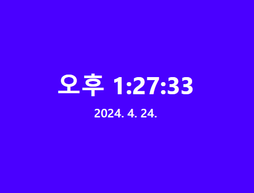

# 리액트로 웹앱 만들기 with 타입스크립트

🤔TODO: React18에서 새로 등장한 기능인 useDeferredValue는 무슨 역할을 하는가?

## 1. 리액트 개발 준비

### 윈도우에서 리액트 개발 환경 만들기

- scoop - 윈도우용 설치 프로그램
- Homebrew - macOS용 설치 프로그램

### VSCode 개발 환경 설정하기

- prettier: 코드 정렬
- Tailwind CSS: CSS스타일링
- Headwind: 테일윈드CSS클래스 분류기
- PostCSS: CSS구문 강조 표시

ctrl + shift + p (mac: command + shift + p) -> User Settings -> 기본설정: 사용자 설정 열기(JSON)

```json
// settings.json
{
  "editor.tabSize": 2,
  // 프리티어 설정
  "editor.defaultFormatter": "esbenp.prettier-vscode",
  "editor.formatOnSave": true,
  "[typescript]": {
    "editor.formatOnPaste": true,
    "editor.formatOnSave": true,
    "editor.defaultFormatter": "esbenp.prettier-vscode"
  }
}
```

```js
// .prettierrc.js
module.exports = {
  bracketSpacing: false,
  jsxBracketSameLine: true,
  singleQuote: true,
  trailingComma: 'none',
  arrowParens: 'avoid',
  semi: false,
  printWidth: 90
}
```

### 리액트 프로젝트 만들기

**CRA 프로젝트 생성**

```bash
npx create-react-app 프로젝트_이름 --template typescript
```

**npm 설치 옵션**

- `--save` : dependencies 항목에 등록됨 (단축 명령 -S)

- `--save-dev` : devDependencies 항목에 등록됨 (단축 명령 -D)

자바스크립트로 개발된 패키지를 타입스크립트에서 사용하려면 `@types/`로 시작하는 타입 라이브러리를 추가로 설치해 줘야 한다.

**chance, luxon 패키지 설치하기**

- chance: 다양한 종류의 그럴듯한 가짜 데이터 제공
- luxon: 날짜 데이터를 '20분 전' 형태로 만들어 주는 유용한 기능 제공

```bash
npm i chance luxon
npm i -D @types/chance @types/luxon
```

## 2. 리액트 동작 원리

- React.StrictMode : 코드가 잘못되었는지 판단하여 적절한 오류 메시지를 보여 주는 컴포넌트
- reportWebVitals : 앱의 성능을 측정하는 기능으로 리액트 개발과는 직접 관련은 없다.

### 가상DOM

- react-dom/client : CSR(Client-Side Rendering)방식 웹 앱
- react-dom/server : SSR(Server-Side Rendering)방식 웹 앱
- react-native : 모바일 앱

> **React17 이후부터 React 임포트 구문이 사라지다.**
>
> ```tsx
> import React from 'react'
> ```
>
> 리액트 17버전 이전에는 JSX 구문이 있는 파일은 반드시 import를 해줘야 했지만, 이후부터는 생략해도 됨.

### 클래스 컴포넌트

```tsx
import {Component} from 'react'

export type ClassComponentProps = {
  href: string
  text: string
}

export default class ClassComponent extends Component<ClassComponentProps> {
  render() {
    const {href, text} = this.props
    return (
      <li>
        <a href={href}>
          <p>{text}</p>
        </a>
      </li>
    )
  }
}
```

### 함수형 컴포넌트

React 16이상부터는 React Hook덕분에 함수형 컴포넌트를 주로 사용.

- function 키워드 방식
- 화살표 방식

> **TypeScript import type 구문**
>
> ```ts
> import type {FC} from 'react'
> import {Component} from 'react'
> ```
>
> 타입스크립트에서 타입은 자바스크립트로 컴파일할 때만 필요한 정보로 컴파일 후 자바스크립트 코드에서는 타입 관련 내용이 완전히 제거된다. 반면에 클래스는 물리적으로 동작하는 메서드와 속성이 있으므로 자바스크립트 코드로 변환돼도 컴파일된 형태로 그대로 남는다.
> 해당 책에서는 FC처럼 타입스크립트 컴파일 때만 필요한 타입을 import type 구문으로 구현했다.

```tsx
import type {FC} from 'react'

export type ArrowComponentProps = {
  href: string
  text: string
}

const ArrowComponent: FC<ArrowComponentProps> = props => {
  const {href, text} = props
  return (
    <li>
      <a href={href}>
        <p>{text}</p>
      </a>
    </li>
  )
}

export default ArrowComponent
```

🤔TODO: type을 붙이면 무엇이 달라지는가?

🤔TODO: type과 interface 차이

```tsx
import type {FC} from 'react'
```

### key와 children 속성 이해하기

#### key 속성

```ts
type Key = string | number
```

: 컴포넌트가 여러 개일 때 이들을 구분하려고 리액트 프레임워크가 만든 속성

#### children 속성

```ts
children?: ReactNode | undefined;
```

리액트 17버전까지는 children 속성을 FC타입에 포함했는데 18버전부터는 FC 타입에서 제거하고 PropsWithChildren이라는 제네릭 타입을 새롭게 제공하였다.

```tsx
import type {FC, PropsWithChildren} from 'react'

export type pProps = {}
const P: FC<PropsWithChildren<pProps>> = props => {
  return <p {...props} />
}

export default P
```

함수 컴포넌트를 정의할 때 PropsWithChildren 타입을 사용하면 Props 타입에 반복해서 children속성을 추가할 필요가 없어지므로 코드를 더 깔끔하게 구성할 수 있다.

```tsx
import type {FC, ReactNode} from 'react'

export type pProps = {
  children?: ReactNode | undefined
}

const P: FC<pProps> = props => {
  return <p {...props} />
}

export default P
```

### 이벤트 속성

#### 이벤트 버블링

Event Bubbling: 자식 요소에서 발생한 이벤트가 가까운 부모 요소에서 가장 먼 부모 요소까지 계속 전달되는 현상

🤔TODO: stopPropagation과 preventDefault 함수

🤔TODO: 이벤트에 대한 타입들 까지도 다 알고 있어야하는건가?

#### `<input>` defaultValue와 defaultChecked 속성

defaultValue와 defaultChecked는 어떤 초깃값을 설정하고 싶을 때 사용

#### 드래그 앤 드롭 이벤트

|   종류    | 발생시기                                                                   | 리액트 이벤트 속성 이름 |
| :-------: | -------------------------------------------------------------------------- | :---------------------: |
| dragenter | 드래그한 요소나 텍스트 블록을 적합한 드롭 대상 위에 올라갔을 때 발생       |       onDragEnter       |
| dragstart | 사용자가 요소나 텍스트 블록을 드래그하기 시작했을 때 발생                  |       onDragStart       |
|   drag    | 요소나 텍스트 블록을 드래그할 때 발생                                      |         onDrag          |
| dragover  | 요소나 텍스트 블록을 적합한 드롭 대상 위로 지나갈 때(수백 밀리초마다) 발생 |       onDragOver        |
| dragleave | 드래그하는 요소나 텍스트 블록이 적합한 드롭 대상에서 벗어났을 때 발생      |       onDragLeave       |
|  dragend  | 드래그를 끝냈을 때 발생                                                    |        onDragEnd        |
|   drop    | 요소나 텍스트 블록을 적합한 드롭 대상에 드롭했을 때 발생                   |         onDrop          |

## 3. 컴포넌트 CSS 스타일링

- tag의 class속성 -> className

- label for속성 -> htmlFor

### 머리티얼 아이콘

```bash
npm install @fontsource/material-icons
```

```tsx
import '@fontsource/material-icons'
```

```css
body {
  font-family: 'Material Icons', sans-serif;
}
```

### Tailwind CSS

CSS관점에서 브라우저 호환성 문제는 -webkit, -moz, -ms 등으로 벤더 접두사 문제. 브라우저마다 이름을 다르게 사용해야하는 문제였다. `autoprefixer`는 사용자 CSS가 벤더 접두사를 붙이지 않더라도 후처리 과정에서 자동으로 벤더 접두사가 붙은 CSS를 생성해 준다.

```bash
npm install -D postcss autoprefixer tailwindcss
```

```bash
npx tailwindcss init -p
```

`postcss.config.js`와 `tailwind.config.js` 파일이 만들어진다.

```js
// postcss.config.js
module.exports = {
  plugins: {
    tailwindcss: {},
    autoprefixer: {}
  }
}
```

```js
// tailwind.config.js
/** @type {import('tailwindcss').Config} */
module.exports = {
  content: [],
  theme: {
    extend: {}
  },
  plugins: []
}
```

**daisyui 패키지 설치**

```bash
npm install -D daisyui
```

**@tailwindcss/line-clamp 플러그인 설치**
tailwind css 3.3 이상부터는 기본으로 포함되어 있어 설치하지 않아도 된다.

> 여기 내용에서는 3.3 이상인데도 추가해야하는데...?

```bash
npm install -D @tailwindcss/line-clamp
```

#### 테일윈드 구성 파일 수정하기

테일윈드CSS 기능 가운데 사용하지 않는 기능은 npm run build 명령 때 제거해 CSS 크기를 최소화할 수 있다.

```js
/** @type {import('tailwindcss').Config} */
module.exports = {
  content: ['./src/**/*.{js,jsx,ts,tsx}'],
  theme: {
    extend: {}
  },
  safelist: [{pattern: /^line-clamp-(\d+)$/}],
  plugins: [require('@tailwindcss/line-clamp'), require('daisyui')]
}
```

` safelist: [{pattern: /^line-clamp-(\d+)$/}]`에서 `\d+`는 line-clamp-으로 시작하는 클래스 이름을 동적으로 조합하더라도 정상으로 동작하도록 트리 쉐이킹 대상에서 제거하는 코드

⚠️여기에 `ts, tsx`에서 white space 하나로 인하여 적용이 안되었었음..

\*트리 쉐이킹: 번들링 과정에서 불필요한 코드(사용되지 않는 모듈)를 식별하고 제거하는 기법

```css
/* index.css에 추가되어야 할 내용 */
@tailwind base;
@tailwind components;
@tailwind utilities;
```

#### 테일윈드CSS 색상 클래스

- 무채색 이름 규칙: 접두사-색상명/불투명도
- 유채색 이름 규칙: 접두사-색상\_이름-채도/불투명도

`<h1>`~`<h6>`, `<p>` 웹브라우저마다 각기 다른 font-size와 line-height 값을 기본으로 설정해두었기에 Tailwind CSS에서는 설정된 글자 크기를 모두 초기화한다.

https://tailwindcss.com/docs/font-size

## 4. 함수 컴포넌트와 리액트 훅

### 시계 컴포넌트 만들기



다음과 같이 시계 이미지를 만든다고 하였을 때 시간이 계속 가게 하려면 어떻게 해야할까?

1. setInterval을 활용한다.
2. 메모리 누수를 없애기 위해 이후 clearInterval 사용

여기까지는 이해하기 쉬운데 어느 타이밍에 clearInterval을 사용할 것인가가 애매모호해진다.

3. useEffect 훅 사용

```ts
useEffect(() => {
  // 컴포넌트가 생성될 때 실행
  return () => {} // 컴포넌트가 소멸할 때 한번 실행
}, [])
```

이제 어디에 무엇을 사용해야하는지는 확연해졌다.

그러면 데이터는 어떻게 적용할 것인가?

4. useState를 사용

useRef의 경우에는 데이터 연결은 되지만 화면단에 구현해야할 때는 useState를 활용하는 것이 좋다.

```tsx
import {useEffect, useState} from 'react'
import Clock from './pages/Clock'

function App() {
  let [today, setToday] = useState(new Date())
  useEffect(() => {
    const duration: number = 1000
    const id = setInterval(() => {
      setToday(new Date())
    }, duration)
    return () => clearInterval(id)
  }, [])

  return (
    <>
      <Clock today={today} />
    </>
  )
}

export default App
```

### 커스텀 훅

새로운 훅 함수를 만들 수 있는데 접두어에 use를 붙여서 만든다.

```ts
// hooks/useInterval.ts
import {useEffect} from 'react'

export const useInterval = (callback: () => void, duration: number = 1000) => {
  useEffect(() => {
    const id = setInterval(callback, duration)
    return () => clearInterval(id)
  }, [callback, duration])
}
```

```ts
// hooks/useClock.ts
import {useState} from 'react'
import {useInterval} from './useInterval'

export const useClock = () => {
  const [today, setToday] = useState(new Date())
  useInterval(() => setToday(new Date()))
  return today
}
```

```tsx
// App.tsx
import {useClock} from './hooks/useClock'
import Clock from './pages/Clock'

function App() {
  const today = useClock()

  return (
    <>
      <Clock today={today} />
    </>
  )
}

export default App
```

### 리액트 훅 함수의 특징

1. 같은 리액트 훅을 여러 번 호출할 수 있다.
2. 함수 몸통이 아닌 몸통 안 복합 실행문의 {} 안에서 호출할 수 없다.
3. 비동기 함수를 콜백 함수로 사용할 수 없다.

### 리액트 훅의 기본 원리

#### 캐시 구현하기

### 데이터를 캐시하는 useMemo 훅

react 패키지는 데이터를 캐시하는 용도로 useMemo 훅을 제공한다.

```ts
// useMemo 훅 사용법
const 캐시된_데이터 = useMemo(콜백함수, [의존성1, 의존성2, ...])
콜백함수 = () => 원본_데이터
```

```tsx
// pages/Memo.tsx
import {useMemo} from 'react'

import * as D from '../data'
import {Avatar, Title} from '../components'

export default function Memo() {
  const headTexts = useMemo<string[]>(
    () => ['NO.', 'NAME', 'JOB TITLE', 'EMAIL ADDRESS'],
    []
  )
  const users = useMemo<D.IUser[]>(() => D.makeArray(100).map(D.makeRandomUser), [])

  const head = useMemo(
    () => headTexts.map(text => <th key={text}>{text}</th>),
    [headTexts]
  )

  const body = useMemo(
    () =>
      users.map((user, index) => (
        <tr key={user.uuid}>
          <th>{index + 1}</th>
          <td className="flex items-center">
            <Avatar src={user.avatar} size="1.5rem" />
            <p className="ml-2">{user.name}</p>
          </td>
          <td>{user.jobTitle}</td>
          <td>{user.email}</td>
        </tr>
      )),
    [users]
  )

  return (
    <div className="mt-4">
      <Title>Memo</Title>
      <div className="overflow-x-auto mt-4 p-4">
        <table className="table table-zebra compact w-full">
          <thead>
            <tr>{head}</tr>
          </thead>
          <tbody>{body}</tbody>
        </table>
      </div>
    </div>
  )
}
```

### 콜백 함수를 캐시하는 useCallback 훅

```ts
// useCallback 훅 사용법
const 캐시된_콜백_함수 = useCallback(원본_콜백_함수, 의존성목록)
```

**권장 방안**

```ts
const onClick = useCallback(() => alert('button clicked'), [])
```

**권장하지 않는 방안**

```ts
const callback = () => alert('button clicked')
const onClick = useCallback(callback, [])
```

위 코드대로 하면 callback 함수는 항상 새로 만들어지므로 useCallback훅을 사용하는 의미가 퇴색된다.

버튼을 누르면 버튼의 text값을 나타나게 하고 싶다.

여기에서는 고차함수을 통해서 해결하였는데 난 다음과 같이 해결하였다.

```tsx
import {useCallback, useMemo} from 'react'

import {Title} from '../components'
import {Button} from '../theme/daisyui'

import * as D from '../data'

export default function Callback() {
  const onClick = useCallback((name: string) => alert(`${name} clicked`), [])

  const buttons = useMemo(
    () =>
      D.makeArray(3)
        .map(D.randomName)
        .map((name, index) => (
          <Button
            key={index}
            onClick={() => onClick(name)}
            className="btn-primary btn-wide btn-xs">
            {name}
          </Button>
        )),
    [onClick]
  )

  return (
    <div className="mt-4">
      <Title>Callback</Title>
      <div className="flex justify-evenly mt-4">{buttons}</div>
    </div>
  )
}
```

**고차함수를 통해 해결한 방안**

```tsx
import {useCallback, useMemo} from 'react'

import {Title} from '../components'
import {Button} from '../theme/daisyui'

import * as D from '../data'

export default function Callback() {
  const onClick = useCallback((name: string) => () => alert(`${name} clicked`), [])

  const buttons = useMemo(
    () =>
      D.makeArray(3)
        .map(D.randomName)
        .map((name, index) => (
          <Button
            key={index}
            onClick={onClick(name)}
            className="btn-primary btn-wide btn-xs">
            {name}
          </Button>
        )),
    [onClick]
  )

  return (
    <div className="mt-4">
      <Title>Callback</Title>
      <div className="flex justify-evenly mt-4">{buttons}</div>
    </div>
  )
}
```
